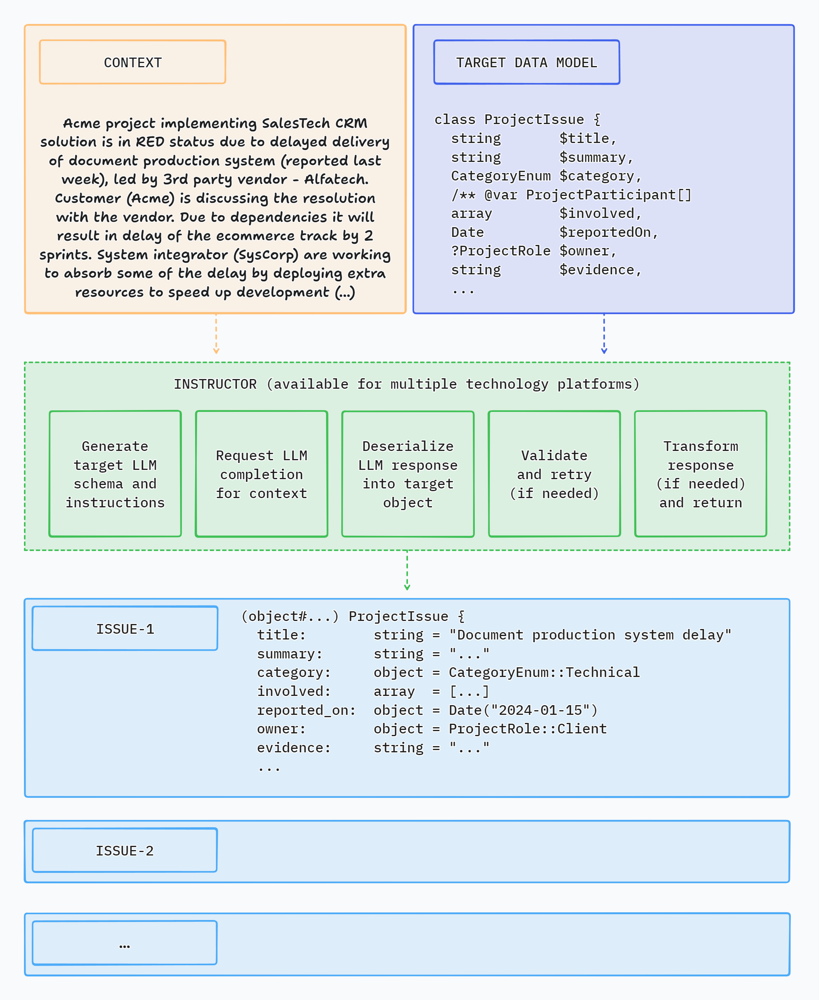
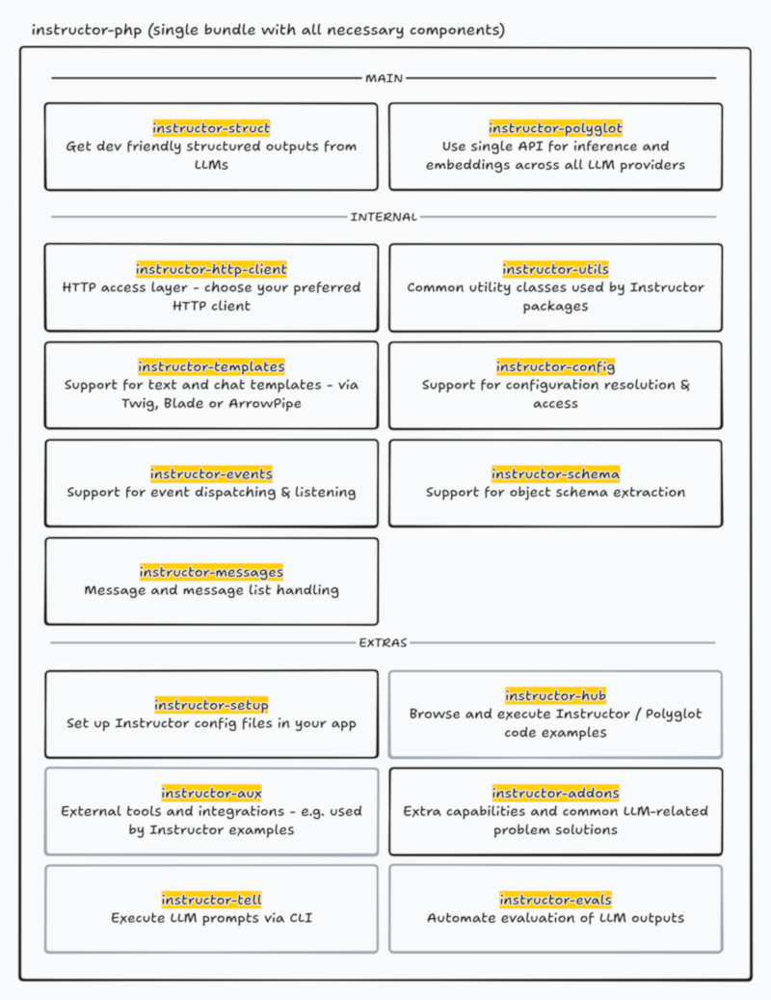

# Instructor for PHP

Structured data extraction in PHP, powered by LLMs. Designed for simplicity, transparency, and control.


## What is Instructor?

Instructor is a library that allows you to extract structured, validated data from multiple types of inputs: text, images or OpenAI style chat sequence arrays. It is powered by Large Language Models (LLMs).

Instructor simplifies LLM integration in PHP projects. It handles the complexity of extracting structured data from LLM outputs, so you can focus on building your application logic and iterate faster.

Instructor for PHP is inspired by the [Instructor](https://jxnl.github.io/instructor/) library for Python created by [Jason Liu](https://twitter.com/jxnlco).



Here's a simple CLI demo app using Instructor to extract structured data from text:


## How Instructor Enhances Your Workflow

Instructor introduces three key enhancements compared to direct API usage.

### Response Model

Specify a PHP class to extract data into via the 'magic' of LLM chat completion. And that's it.

Instructor reduces brittleness of the code extracting the information from textual data by leveraging structured LLM responses.

Instructor helps you write simpler, easier to understand code: you no longer have to define lengthy function call definitions or write code for assigning returned JSON into target data objects.

### Validation

Response model generated by LLM can be automatically validated, following set of rules. Currently, Instructor supports only Symfony validation.

You can also provide a context object to use enhanced validator capabilities.

### Max Retries

You can set the number of retry attempts for requests.

Instructor will repeat requests in case of validation or deserialization error up to the specified number of times, trying to get a valid response from LLM.

### Support for LLM Providers

Instructor offers out-of-the-box support for the following LLM providers:

- A21 / Mamba
- Anthropic
- Azure OpenAI
- Cerebras
- Cohere (v1 and v2)
- Deepseek
- Fireworks
- Google Gemini (native and OpenAI compatible)
- Groq
- Minimaxi
- Mistral
- Moonshot / Kimi
- Ollama (on localhost)
- OpenAI
- OpenRouter
- Perplexity
- Sambanova
- Together AI
- xAI / Grok

For usage examples, check Hub section or `examples` directory in the code repository.


## Usage


### Basic Example

This is a simple example demonstrating how Instructor retrieves structured information from provided text (or chat message sequence).

Response model class is a plain PHP class with typehints specifying the types of fields of the object.

```php
use Cognesy\Instructor\StructuredOutput;

// Step 0: Create .env file in your project root:
// OPENAI_API_KEY=your_api_key

// Step 1: Define target data structure(s)
class Person {
    public string $name;
    public int $age;
}

// Step 2: Provide content to process
$text = "His name is Jason and he is 28 years old.";

// Step 3: Use Instructor to run LLM inference
$person = (new StructuredOutput)
    ->withResponseClass(Person::class)
    ->generate(
        messages: $text,
    );

// Step 4: Work with structured response data
assert($person instanceof Person); // true
assert($person->name === 'Jason'); // true
assert($person->age === 28); // true

echo $person->name; // Jason
echo $person->age; // 28

var_dump($person);
// Person {
//     name: "Jason",
//     age: 28
// }    
```
> **NOTE:** Instructor supports classes / objects as response models. In case you want to extract simple types or enums, you need to wrap them in Scalar adapter - see section below: Extracting Scalar Values.
>

### Validation

Instructor validates results of LLM response against validation rules specified in your data model.

> For further details on available validation rules, check [Symfony Validation constraints](https://symfony.com/doc/current/validation.html#constraints).

```php
use Symfony\Component\Validator\Constraints as Assert;

class Person {
    public string $name;
    #[Assert\PositiveOrZero]
    public int $age;
}

$text = "His name is Jason, he is -28 years old.";
$person = (new StructuredOutput)
    ->withResponseClass(Person::class)
    ->generate(
        messages: [['role' => 'user', 'content' => $text]],
    );

// if the resulting object does not validate, Instructor throws an exception
```


### Max Retries

In case maxRetries parameter is provided and LLM response does not meet validation criteria, Instructor will make subsequent inference attempts until results meet the requirements or maxRetries is reached.

Instructor uses validation errors to inform LLM on the problems identified in the response, so that LLM can try self-correcting in the next attempt.

```php
use Symfony\Component\Validator\Constraints as Assert;

class Person {
    #[Assert\Length(min: 3)]
    public string $name;
    #[Assert\PositiveOrZero]
    public int $age;
}

$text = "His name is JX, aka Jason, he is -28 years old.";
$person = (new StructuredOutput)->generate(
    messages: [['role' => 'user', 'content' => $text]],
    responseModel: Person::class,
    maxRetries: 3,
);

// if all LLM's attempts to self-correct the results fail, Instructor throws an exception
```


### Output Modes

Instructor supports multiple output modes to allow working with various models depending on their capabilities.
- `OutputMode::Json` - generate structured output via LLM's native JSON generation 
- `OutputMode::JsonSchema` - use LLM's strict JSON Schema mode to enforce JSON Schema
- `OutputMode::Tools` - use tool calling API to get LLM follow provided schema
- `OutputMode::MdJson` - use prompting to generate structured output; fallback for the models that do not support JSON generation or tool calling

Additionally, you can use `OutputMode::Text` to get LLM to generate text output without any structured data extraction.

- `OutputMode::Text` - generate text output
- `OutputMode::Unrestricted` - generate unrestricted output based on inputs provided by the user (with no enforcement of specific output format)


## Documentation

Check out the [documentation website](https://docs.instructorphp.com/) for more details and examples of how to use Instructor for PHP.


## Feature Highlights

### Core features

- Get structured responses from LLMs without writing boilerplate code
- Validation of returned data
- Automated retries in case of errors when LLM responds with invalid data
- Integrate LLM support into your existing PHP code with minimal friction - no framework, no extensive code changes
- Framework agnostic - use it with Laravel, Symfony, your custom framework, or - with no framework at all

### Various extraction modes

- Supports multiple extraction modes to allow working with various models depending on their capabilities
- `OutputMode::Json` - use response_format to get LLM follow provided JSON Schema
- `OutputMode::JsonSchema` - use strict JSON Schema mode to get LLM follow provided JSON Schema
- `OutputMode::Tools` - use tool calling API to get LLM follow provided JSON Schema
- `OutputMode::MdJson` - extract via prompting LLM to nudge it to generate provided JSON Schema

### Flexible inputs

- Process various types of input data: text, series of chat messages or images using the same, simple API
- 'Structured-to-structured' processing - provide object or array as an input and get object with the results of inference back
- Demonstrate examples to improve the quality of inference

### Customization

- Define response data model the way you want: type-hinted classes, JSON Schema arrays, or dynamic data shapes with `Structure` class
- Customize prompts and retry prompts
- Use attributes or PHP DocBlocks to provide additional instructions for LLM
- Customize response model processing by providing your own implementation of schema, deserialization, validation and transformation interfaces

### Sync and streaming support

- Supports both synchronous or streaming responses
- Get partial updates & stream completed sequence items

### Observability

- Get detailed insight into internal processing via events
- Debug mode to see the details of LLM API requests and responses

### Support for multiple LLMs / API providers

- Easily switch between LLM providers
- Support for most popular LLM APIs (incl. OpenAI, Gemini, Anthropic, Cohere, Azure, Groq, Mistral, Fireworks AI, Together AI)
- OpenRouter support - access to 100+ language models
- Use local models with Ollama

### Other capabilities

- Developer friendly LLM context caching for reduced costs and faster inference (for Anthropic models)
- Developer friendly data extraction from images (for OpenAI, Anthropic and Gemini models)
- Generate vector embeddings using APIs of multiple supported LLM providers

### Documentation and examples

- Learn more from growing documentation and 100+ cookbooks


## Instructor in Other Languages

Check out implementations in other languages below:

- [Python](https://useinstructor.com) (original)
- [Javascript](https://js.useinstructor.com/) (port)
- [Elixir](https://hexdocs.pm/instructor/Instructor.html) (port)
- [Ruby](https://ruby.useinstructor.com/) (port)

If you want to port Instructor to another language, please reach out to us on [Twitter](https://twitter.com/jxnlco) we'd love to help you get started!


## Instructor Packages

This repository is a monorepo containing all Instructor's components (required and optional). It hosts all that you need to work with LLMs via Instructor.

Individual components are also distributed as standalone packages that can be used independently.



Links to read-only repositories of the standalone package distributions:

- [instructor-addons](https://github.com/cognesy/instructor-addons) - extra capabilities and common LLM-related problem solutions
- [instructor-aux](https://github.com/cognesy/instructor-aux) - external tools and integrations, e.g. used by Instructor examples
- [instructor-evals](https://github.com/cognesy/instructor-evals) - LLM output evaluation tools
- [instructor-http-client](https://github.com/cognesy/instructor-http-client) - easily switch between underlying HTTP client libraries (out-of-the-box support for Guzzle, Symfony, Laravel)
- [instructor-hub](https://github.com/cognesy/instructor-hub) - CLI tool for browsing and running Instructor examples
- [instructor-polyglot](https://github.com/cognesy/instructor-polyglot) - use single API for inference and embeddings across most of LLM providers, easily switch between them (e.g., develop on Ollama, switch to Groq in production)
- [instructor-setup](https://github.com/cognesy/instructor-setup) - CLI tool for publishing Instructor config files in your app
- [instructor-struct](https://github.com/cognesy/instructor-struct) - get dev friendly structured outputs from LLMs
- [instructor-tell](https://github.com/cognesy/instructor-tell) - CLI tool for executing LLM prompts in your terminal
- [instructor-templates](https://github.com/cognesy/instructor-templates) - text and chat template tools used by Instructor, support Twig, Blade and ArrowPipe formats
- [instructor-utils](https://github.com/cognesy/instructor-utils) - common utility classes used by Instructor packages

> NOTE: If you are just starting to use Instructor, I recommend using the `instructor-php` package. It contains all the required components and is the easiest way to get started with the library.


## License

This project is licensed under the terms of the MIT License.


## Support

If you have any questions or need help, please reach out to me on [Twitter](https://twitter.com/ddebowczyk) or [GitHub](https://github.com/cognesy/instructor-php/issues).


## Contributing

If you want to help, check out some of the issues. All contributions are welcome - code improvements, documentation, bug reports, blog posts / articles, or new cookbooks and application examples.


## Contributors

<!-- ALL-CONTRIBUTORS-LIST:START - Do not remove or modify this section -->
<!-- prettier-ignore-start -->
<!-- markdownlint-disable -->

<!-- markdownlint-restore -->
<!-- prettier-ignore-end -->

<!-- ALL-CONTRIBUTORS-LIST:END -->

<a href="https://github.com/cognesy/instructor-php/graphs/contributors">
  
</a>

