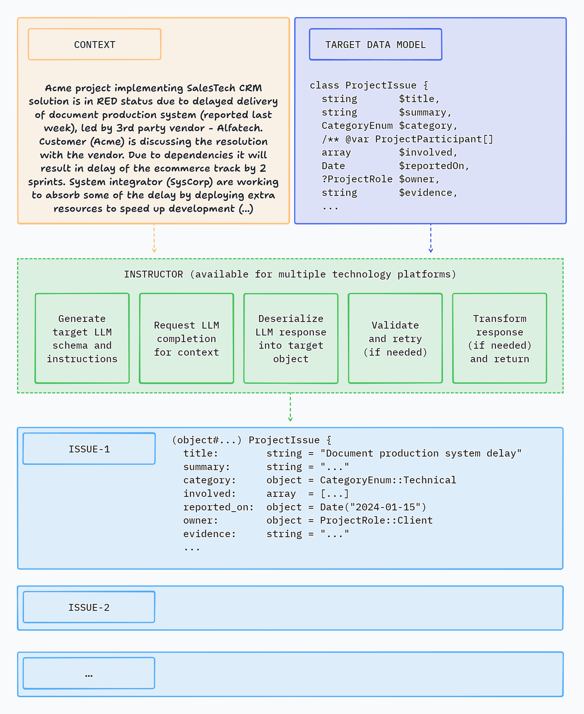

## What is Instructor?

Instructor is a library that allows you to get structured, validated data from multiple types of inputs: text,
 chat messages, or images. It is powered by Large Language Models (LLMs).

The library is inspired by the [Instructor](https://jxnl.github.io/instructor/) for Python created by [Jason Liu](https://twitter.com/jxnlco).

## How it works

Instructor uses Large Language Models (LLMs) to process data and return structured information you can easily use in your code.

## Instructor in action

Here's a simple CLI demo app using Instructor to extract structured data from text:

## How Instructor Enhances Your Workflow

Instructor introduces three key enhancements compared to direct API usage.

### Response Model

You just specify a PHP class to extract data into via the 'magic' of LLM chat completion. And that's it.

Instructor reduces brittleness of the code extracting the information from textual data by leveraging structured LLM responses.

Instructor helps you write simpler, easier to understand code - you no longer have to define lengthy function call definitions or write code for assigning returned JSON into target data objects.

### Validation

Response model generated by LLM can be automatically validated, following set of rules. Currently, Instructor supports only Symfony validation.

You can also provide a context object to use enhanced validator capabilities.

### Max Retries

You can set the number of retry attempts for requests.

Instructor will repeat requests in case of validation or deserialization error up to the specified number of times, trying to get a valid response from LLM.

