# Beads Viewer (bv)


> **The elegant, keyboard-driven terminal interface for the [Beads](https://github.com/steveyegge/beads) issue tracker.**

<div align="center" style="margin: 1.2em 0;">
  <table>
    <tr>
      <td align="center" style="padding: 8px;">
        
        <div><sub>Main split view: fast list + rich details</sub></div>
      </td>
      <td align="center" style="padding: 8px;">
        
        <div><sub>Kanban board (`b`) for flow at a glance</sub></div>
      </td>
    </tr>
    <tr>
      <td align="center" style="padding: 8px;">
        
        <div><sub>Insights panel: PageRank, critical path, cycles</sub></div>
      </td>
      <td align="center" style="padding: 8px;">
        
        <div><sub>Graph view (`g`): navigate the dependency DAG</sub></div>
      </td>
    </tr>
  </table>
</div>

### ⚡ Quick Install

```bash
curl -fsSL https://raw.githubusercontent.com/Dicklesworthstone/beads_viewer/main/install.sh | bash
```

---

## 💡 TL;DR

`bv` is a high-performance **Terminal User Interface (TUI)** for browsing and managing tasks in projects that use the **Beads** issue tracking system. 

**Why you'd care:**
*   **Speed:** Browse thousands of issues instantly with zero network latency.
*   **Focus:** Stay in your terminal and use Vim-style keys (`j`/`k`) to navigate.
*   **Intelligence:** It visualizes your project as a **dependency graph**, automatically highlighting bottlenecks, cycles, and critical paths that traditional list-based trackers miss.
*   **AI-Ready:** It provides structured, pre-computed insights for AI coding agents, acting as a "brain" for your project's task management.

---

## 📖 The Core Experience

At its heart, `bv` is about **viewing your work nicely**.

### ⚡ Fast, Fluid Browsing
No web page loads, no heavy clients. `bv` starts instantly and lets you fly through your issue backlog using standard Vim keys (`j`/`k`).
*   **Split-View Dashboard:** On wider screens, see your list on the left and full details on the right.
*   **Markdown Rendering:** Issue descriptions, comments, and notes are beautifully rendered with syntax highlighting, headers, and lists.
*   **Instant Filtering:** Zero-latency filtering. Press `o` for Open, `c` for Closed, or `r` for Ready (unblocked) tasks.

### 🔎 Rich Context
Don't just read the title. `bv` gives you the full picture:
*   **Comments & History:** Scroll through the full conversation history of any task.
*   **Metadata:** Instantly see Assignees, Labels, Priority badges, and creation dates.
*   **Search:** Powerful fuzzy search (`/`) finds issues by ID, title, or content instantly.

### 🎯 Focused Workflows
*   **Kanban Board:** Press `b` to switch to a columnar view (Open, In Progress, Blocked, Closed) to visualize flow.
*   **Visual Graph:** Press `g` to explore the dependency tree visually.
*   **Insights:** Press `i` to see graph metrics and bottlenecks.
*   **Ultra-Wide Mode:** On large monitors, the list expands to show extra columns like sparklines and label tags.

### 🛠️ Quick Actions
*   **Export:** Press `E` to export all issues to a timestamped Markdown file with Mermaid diagrams.
*   **Copy:** Press `C` to copy the selected issue as formatted Markdown to your clipboard.
*   **Edit:** Press `O` to open the `.beads/beads.jsonl` file in your preferred GUI editor.
*   **Time-Travel:** Press `t` to compare against any git revision, or `T` for quick HEAD~5 comparison.

---

## 🤖 Ready-made Blurb to Drop Into Your AGENTS.md or CLAUDE.md Files

```
### Using bv as an AI sidecar

  bv is a fast terminal UI for Beads projects (.beads/beads.jsonl). It renders lists/details and precomputes dependency metrics (PageRank, critical path, cycles, etc.) so you instantly see blockers and execution order. For agents, it’s a graph sidecar: instead of parsing JSONL or risking hallucinated traversal, call the robot flags to get deterministic, dependency-aware outputs.

  - bv --robot-help — shows all AI-facing commands.
  - bv --robot-insights — JSON graph metrics (PageRank, betweenness, HITS, critical path, cycles) with top-N summaries for quick triage.
  - bv --robot-plan — JSON execution plan: parallel tracks, items per track, and unblocks lists showing what each item frees up.
  - bv --robot-priority — JSON priority recommendations with reasoning and confidence.
  - bv --robot-recipes — list recipes (default, actionable, blocked, etc.); apply via bv --recipe <name> to pre-filter/sort before other flags.
  - bv --robot-diff --diff-since <commit|date> — JSON diff of issue changes, new/closed items, and cycles introduced/resolved.

  Use these commands instead of hand-rolling graph logic; bv already computes the hard parts so agents can act safely and quickly.
```


## 📐 Architecture & Design

`bv` treats your project as a **Directed Acyclic Graph (DAG)**, not just a list. This allows it to derive insights about what is *truly* important.

```mermaid
graph TD
    %% Soft Pastel Theme — Refined
    classDef data fill:#e3f2fd,stroke:#90caf9,stroke-width:2px,color:#1565c0,rx:8
    classDef logic fill:#fff8e1,stroke:#ffcc80,stroke-width:2px,color:#e65100,rx:8
    classDef ui fill:#f3e5f5,stroke:#ce93d8,stroke-width:2px,color:#6a1b9a,rx:8
    classDef output fill:#e8f5e9,stroke:#a5d6a7,stroke-width:2px,color:#2e7d32,rx:8

    subgraph storage [" 📂 Data Layer "]
        A[".beads/beads.jsonl<br/>JSONL Issue Store"]:::data
    end

    subgraph engine [" ⚙️ Analysis Engine "]
        B["Loader"]:::logic
        C["Graph Builder"]:::logic
        D["9 Metrics<br/>PageRank · Betweenness · HITS..."]:::logic
    end

    subgraph interface [" 🖥️ TUI Layer "]
        E["Bubble Tea Model"]:::ui
        F["List View"]:::ui
        G["Graph View"]:::ui
        H["Insights Dashboard"]:::ui
    end

    subgraph outputs [" 📤 Outputs "]
        I["--robot-insights<br/>JSON for AI Agents"]:::output
        J["--export-md<br/>Markdown Report"]:::output
    end

    A --> B
    B --> C
    C --> D
    D --> E
    D --> I
    D --> J
    E --> F
    E --> G
    E --> H

    linkStyle 0,1,2 stroke:#90caf9,stroke-width:2px
    linkStyle 3,4,5 stroke:#ffcc80,stroke-width:2px
    linkStyle 6,7,8 stroke:#ce93d8,stroke-width:2px
```



### Key Metrics & Algorithms
`bv` computes **9 graph-theoretic metrics** to surface hidden project dynamics:

| # | Metric | What It Measures | Key Insight |
|---|--------|------------------|-------------|
| 1 | **PageRank** | Recursive dependency importance | Foundational blockers |
| 2 | **Betweenness** | Shortest-path traffic | Bottlenecks & bridges |
| 3 | **HITS** | Hub/Authority duality | Epics vs. utilities |
| 4 | **Critical Path** | Longest dependency chain | Keystones with zero slack |
| 5 | **Eigenvector** | Influence via neighbors | Strategic dependencies |
| 6 | **Degree** | Direct connection counts | Immediate blockers/blocked |
| 7 | **Density** | Edge-to-node ratio | Project coupling health |
| 8 | **Cycles** | Circular dependencies | Structural errors |
| 9 | **Topo Sort** | Valid execution order | Work queue foundation |

### 1. PageRank (Dependency Authority)
**The Math:** Originally designed to rank web pages by "importance" based on incoming links, PageRank models a "random surfer" walking the graph. In our dependency graph (u → v implies u depends on v), we treat dependencies as "votes" of importance.
$$
PR(v) = \frac{1-d}{N} + d \sum_{u \in M(v)} \frac{PR(u)}{L(u)}
$$

**The Intuition:** If many tasks depend on Task A, or if a single very important Task B depends on Task A, then Task A implicitly becomes "heavy." A random walker following dependency links will frequently get stuck at Task A.

**Pragmatic Meaning:** **Foundational Blocks.** High PageRank tasks are the bedrock of your project. They are rarely "features" in the user-facing sense; they are often schemas, core libraries, or architectural decisions. Breaking them breaks the graph.

### 2. Betweenness Centrality (Bottlenecks)
**The Math:** Defined as the fraction of all shortest paths in the network that pass through a given node $v$.
$$C_B(v) = \sum_{s \neq v \neq t} \frac{\sigma_{st}(v)}{\sigma_{st}}$$

**The Intuition:** Imagine information (or progress) flowing from every task to every other task along the most efficient route. "Bridge nodes" that connect otherwise isolated clusters (e.g., the Frontend cluster and the Backend cluster) will see a massive amount of traffic.

**Pragmatic Meaning:** **Gatekeepers & Bottlenecks.** A task with high Betweenness is a choke point. It might be an API contract that both the mobile app and the server team are waiting on. If this task is delayed, it doesn't just block one thread; it prevents entire sub-teams from synchronizing.

### 3. HITS (Hubs & Authorities)
**The Math:** An iterative algorithm that defines two scores for every node:
*   **Authority:** The sum of Hub scores of nodes pointing to it.
*   **Hub:** The sum of Authority scores of nodes it points to.

**The Intuition:** This models a "mutually reinforcing" relationship. Good libraries (Authorities) are used by many applications. Good applications (Hubs) use many good libraries.

**Pragmatic Meaning:** **Epics vs. Infrastructure.**
*   **High Hub Score:** These are your **Epics** or **Product Features**. They aggregate many dependencies to deliver value.
*   **High Authority Score:** These are your **Utilities**. They provide value to many consumers.

### 4. Critical Path (Longest Path in DAG)
**The Math:** In a DAG, the longest path represents the minimum time required to complete the project (assuming infinite parallelism). `bv` computes this recursively:
$$Impact(u) = 1 + \max(\{Impact(v) \mid u \to v\})$$

**The Intuition:** If you hold the graph by its "leaf" nodes (tasks with no dependencies) and let it dangle, the tasks at the very top that support the longest chains are carrying the most weight.

**Pragmatic Meaning:** **Keystones.** A Keystone task is one where *any* delay translates 1:1 into a delay for the final project delivery. These tasks have zero "slack."

### 5. Eigenvector Centrality (Influential Neighbors)
**The Math:** Eigenvector centrality measures a node's influence by considering not just its connections, but the importance of those connections. A node with few but highly influential neighbors can score higher than a node with many unimportant neighbors.
$$x_i = \frac{1}{\lambda} \sum_{j \in N(i)} x_j$$

Where $\lambda$ is the largest eigenvalue of the adjacency matrix and $N(i)$ are neighbors of node $i$.

**The Intuition:** It's not just *how many* connections you have, but *who* you're connected to. Being depended on by a critical task makes you more important than being depended on by many trivial tasks.

**Pragmatic Meaning:** **Strategic Dependencies.** High Eigenvector tasks are connected to the "power players" in your graph. They may not have many direct dependents, but their dependents are themselves critical.

### 6. Degree Centrality (Direct Connections)
**The Math:** The simplest centrality measure—just count the edges.
$$C_D^{in}(v) = |\{u : u \to v\}|$$

$$C_D^{out}(v) = |\{u : v \to u\}|$$

**The Intuition:**
*   **In-Degree:** How many tasks depend on me? (I am a blocker)
*   **Out-Degree:** How many tasks do I depend on? (I am blocked)

**Pragmatic Meaning:** **Immediate Impact.**
*   **High In-Degree:** This task is a direct blocker for many others. Completing it immediately unblocks work.
*   **High Out-Degree:** This task has many prerequisites. It's likely to be blocked and should be scheduled later in the execution plan.

### 7. Graph Density (Interconnectedness)
**The Math:** Density measures how "connected" the graph is relative to its maximum possible connections.
$$D = \frac{|E|}{|V|(|V|-1)}$$

Where $|E|$ is the edge count and $|V|$ is the node count. For a directed graph, the maximum edges is $|V|(|V|-1)$.

**The Intuition:** A density of 0.0 means no dependencies exist (isolated tasks). A density approaching 1.0 means everything depends on everything (pathological complexity).

**Pragmatic Meaning:** **Project Health Indicator.**
*   **Low Density (< 0.05):** Healthy. Tasks are relatively independent and can be parallelized.
*   **Medium Density (0.05 - 0.15):** Normal. Reasonable interconnection reflecting real-world dependencies.
*   **High Density (> 0.15):** Warning. Overly coupled project. Consider breaking into smaller modules.

### 8. Cycle Detection (Circular Dependencies)
**The Math:** A cycle in a directed graph is a path v₁ → v₂ → ⋯ → vₖ → v₁ where the start and end nodes are identical. `bv` uses Tarjan's algorithm variant via `topo.DirectedCyclesIn` to enumerate all elementary cycles.

**The Intuition:** If A depends on B, and B depends on A, neither can ever be completed. This is a logical impossibility that must be resolved.

**Pragmatic Meaning:** **Structural Errors.** Cycles are **bugs in your project plan**, not just warnings. They indicate:
*   Misclassified dependencies (A doesn't really block B, or vice versa)
*   Missing intermediate tasks (A and B both depend on an unstated C)
*   Scope confusion (A and B should be merged into a single task)

### 9. Topological Sort (Execution Order)
**The Math:** A topological ordering of a DAG is a linear sequence of all vertices such that for every edge u → v, vertex u appears before v in the sequence. Only acyclic graphs have valid topological orderings.

**The Intuition:** If you must complete tasks in dependency order, topological sort gives you *a* valid order (there may be many).

**Pragmatic Meaning:** **Work Queue.** The topological order is the foundation of `bv`'s execution planning. Combined with priority weights, it generates the "what to work on next" recommendations that power `--robot-plan`.

---

## 🤖 The Robot Protocol (AI Interface)

`bv` bridges the gap between raw data and AI agents. Agents struggle with graph algorithms; `bv` solves this by acting as a deterministic "sidecar" that offloads the cognitive burden of graph traversal.


### The "Cognitive Offloading" Strategy
The primary design goal of the Robot Protocol is **Cognitive Offloading**.
Large Language Models (LLMs) are probabilistic engines; they are excellent at semantic reasoning (coding, writing) but notoriously unreliable at algorithmic graph traversal (finding cycles, computing shortest paths).

If you feed an Agent raw `beads.jsonl` data, you are forcing the Agent to:
1.  Parse thousands of lines of JSON.
2.  Reconstruct the dependency graph in its context window.
3.  "Hallucinate" a path traversal or cycle check.

`bv` solves this by providing a deterministic graph engine sidecar.

### Why `bv` vs. Raw Beads?
Using `beads` directly gives an agent *data*. Using `bv --robot-insights` gives an agent *intelligence*.

| Capability | Raw Beads (JSONL) | `bv` Robot Mode |
| :--- | :--- | :--- |
| **Query** | "List all issues." | "List the top 5 bottlenecks blocking the release." |
| **Context Cost** | High (Linear with issue count). | Low (Fixed summary struct). |
| **Graph Logic** | Agent must infer/compute. | Pre-computed (PageRank/Brandes). |
| **Safety** | Agent might miss a cycle. | Cycles explicitly flagged. |

### Agent Usage Patterns
Agents typically use `bv` in three phases:

1.  **Triage & Orientation:**
    Before starting a session, the agent runs `bv --robot-insights`. It receives a lightweight JSON summary of the project's structural health. It immediately knows:
    *   "I should not work on Task C yet because it depends on Task B, which is a Bottleneck."
    *   "The graph has a cycle (A->B->A); I must fix this structural error before adding new features."

2.  **Impact Analysis:**
    When asked to "refactor the login module," the agent checks the **PageRank** and **Impact Scores** of the relevant beads. If the scores are high, the agent knows this is a high-risk change with many downstream dependents, prompting it to run more comprehensive tests.

3.  **Execution Planning:**
    Instead of guessing the order of operations, the agent uses `bv`'s topological sort to generate a strictly linearized plan.

**JSON Output Schema (`--robot-insights`):**
The output is designed to be strictly typed and easily parseable by tools like `jq` or standard JSON libraries.
```json
{
  "bottlenecks": [
    { "id": "CORE-123", "value": 0.45 }
  ],
  "keystones": [
    { "id": "API-001", "value": 12.0 }
  ],
  "influencers": [
    { "id": "AUTH-007", "value": 0.82 }
  ],
  "hubs": [
    { "id": "EPIC-100", "value": 0.67 }
  ],
  "authorities": [
    { "id": "UTIL-050", "value": 0.91 }
  ],
  "cycles": [
    ["TASK-A", "TASK-B", "TASK-A"]
  ],
  "clusterDensity": 0.045,
  "stats": {
    "pageRank": { "CORE-123": 0.15, "...": "..." },
    "betweenness": { "CORE-123": 0.45, "...": "..." },
    "eigenvector": { "AUTH-007": 0.82, "...": "..." },
    "hubs": { "EPIC-100": 0.67, "...": "..." },
    "authorities": { "UTIL-050": 0.91, "...": "..." },
    "inDegree": { "CORE-123": 5, "...": "..." },
    "outDegree": { "CORE-123": 2, "...": "..." },
    "criticalPathScore": { "API-001": 12.0, "...": "..." },
    "density": 0.045,
    "topologicalOrder": ["CORE-123", "API-001", "..."]
  }
}
```

| Field | Metric | What It Contains |
|-------|--------|------------------|
| `bottlenecks` | Betweenness | Top nodes bridging graph clusters |
| `keystones` | Critical Path | Top nodes on longest dependency chains |
| `influencers` | Eigenvector | Top nodes connected to important neighbors |
| `hubs` | HITS Hub | Top dependency aggregators (Epics) |
| `authorities` | HITS Authority | Top prerequisite providers (Utilities) |
| `cycles` | Cycle Detection | All circular dependency paths |
| `clusterDensity` | Density | Overall graph interconnectedness |
| `stats` | All Metrics | Full raw data for custom analysis |

---

## 🎨 TUI Engineering & Craftsmanship

`bv` is built with the **Bubble Tea** framework, ensuring a glitch-free, 60fps experience. It features an adaptive layout engine that responds to terminal resize events and a custom ASCII/Unicode graph renderer.

```mermaid
flowchart LR
    classDef core fill:#fef3e2,stroke:#f5d0a9,stroke-width:2px,color:#8b5a2b
    classDef engine fill:#f0e6f6,stroke:#d4b8e0,stroke-width:2px,color:#5d3a6b
    classDef ui fill:#e6f3e6,stroke:#b8d9b8,stroke-width:2px,color:#2d5a2d
    classDef output fill:#e8f4f8,stroke:#b8d4e3,stroke-width:2px,color:#2c5f7c

    INPUT["⌨️ Input<br/>Keys · Mouse · Resize"]:::core
    MODEL["🫖 Model<br/>Issues · Stats · Focus"]:::core
    GRAPH["🧮 Graph Engine<br/>PageRank · HITS · Cycles"]:::engine
    VIEWS["🖼️ Views<br/>List · Board · Graph · Insights"]:::ui
    LAYOUT["📐 Layout<br/>Mobile · Split · Wide"]:::ui
    TERM["🖥️ Terminal<br/>60fps Output"]:::output

    INPUT -->|tea.Msg| MODEL
    GRAPH -->|metrics| MODEL
    MODEL -->|state| VIEWS
    VIEWS --> LAYOUT
    LAYOUT --> TERM

    linkStyle 0 stroke:#f5d0a9,stroke-width:2px
    linkStyle 1 stroke:#d4b8e0,stroke-width:2px
    linkStyle 2 stroke:#b8d9b8,stroke-width:2px
    linkStyle 3,4 stroke:#b8d4e3,stroke-width:2px
```



### 1. Adaptive Layout Engine
`bv` doesn't just dump text; it calculates geometry on every render cycle.
*   **Dynamic Resizing:** The `View()` function inspects the current terminal width (`msg.Width`) on every frame.
*   **Breakpoint Logic:**
    *   `< 100 cols`: **Mobile Mode**. List takes 100% width.
    *   `> 100 cols`: **Split Mode**. List takes 40%, Details take 60%.
    *   `> 140 cols`: **Ultra-Wide**. List injects extra columns (Sparklines, Labels) that are normally hidden.
*   **Padding Awareness:** The layout engine explicitly accounts for borders (2 chars) and padding (2 chars) to prevent "off-by-one" wrapping errors that plague many TUIs.

### 2. Zero-Latency Virtualization
Rendering 10,000 issues would choke a naive terminal app. `bv` implements **Viewport Virtualization**:
*   **Windowing:** We only render the slice of rows currently visible in the terminal window.
*   **Pre-Computation:** Graph metrics (PageRank, etc.) are computed *once* at startup in a separate goroutine, not on every frame.
*   **Detail Caching:** The Markdown renderer is instantiated lazily and reused, avoiding expensive regex recompilation.

### 3. Visual Graph Engine (`pkg/ui/graph.go`)
We built a custom 2D ASCII/Unicode rendering engine from scratch to visualize the dependency graph.
*   **Canvas Abstraction:** A 2D grid of `rune` cells and `style` pointers allows us to draw "pixels" in the terminal.
*   **Manhattan Routing:** Edges are drawn using orthogonal lines with proper Unicode corner characters ( `╭`, `─`, `╮`, `│`, `╰`, `╯`) to minimize visual noise.
*   **Topological Layering:** Nodes are arranged in layers based on their "Impact Depth," ensuring that dependencies always flow downwards.

### 4. Thematic Consistency
We use **[Lipgloss](https://github.com/charmbracelet/lipgloss)** to enforce a strict design system.
*   **Semantic Colors:** Colors are defined semantically (`Theme.Blocked`, `Theme.Open`) rather than hardcoded hex values. This allows `bv` to switch between "Dracula" (Dark) and "Light" modes seamlessly.
*   **Status Indicators:** We use Nerd Font glyphs (`🐛`, `✨`, `🔥`) paired with color coding to convey status instantly without reading text.

---

## 📈 Visual Data Encoding: Sparklines & Heatmaps

In dense information environments like the terminal, text is expensive. `bv` employs high-density data visualization techniques (`pkg/ui/visuals.go`) inspired by Edward Tufte to convey complex metrics in minimal space.

### 1. Unicode Sparklines
When viewing the list in Ultra-Wide mode, `bv` renders a "Graph Score" column using Unicode block characters (` `, `▂`, `▃`, `▄`, `▅`, `▆`, `▇`, `█`).
*   **The Math:** `RenderSparkline(val, width)` normalizes a float value (0.0 - 1.0) against the available character width. It calculates the precise block height for each character cell to create a continuous bar chart effect.
*   **The Utility:** This allows you to scan a list of 50 issues and instantly spot the "spikes" in complexity or centrality without reading a single number.

### 2. Semantic Heatmaps
We don't just use random colors. `pkg/ui/visuals.go` implements a perceptually uniform color ramp (`GetHeatmapColor`) that maps metric intensity to a gradient:
*   `0.0 - 0.2`: **Low** (Gray/Dim)
*   `0.2 - 0.5`: **Mid** (Blue/Cool)
*   `0.5 - 0.8`: **High** (Purple/Warm)
*   `0.8 - 1.0`: **Peak** (Pink/Hot)
This visual encoding is applied to badges in the Insights Dashboard, allowing you to differentiate between "somewhat important" and "critically urgent" tasks at a glance.

---

## 🔍 Search Architecture

In a project with thousands of issues, you cannot afford to wait for a backend query. `bv` implements a **composite, in-memory fuzzy search** that feels instantaneous.

### The "Flattened Vector" Index
Instead of searching fields individually (which requires complex UI controls), `bv` flattens every issue into a single searchable "vector" at load time.
The `FilterValue()` method constructs a composite string containing:
*   **Core Identity:** ID (`"CORE-123"`) and Title (`"Fix login race condition"`)
*   **Metadata:** Status (`"open"`), Type (`"bug"`), Priority
*   **Context:** Assignee (`"@steve"`) and Labels (`"frontend, v1.0"`)

### Fuzzy Subsequence Matching
When you press `/`, the search engine performs a **fuzzy subsequence match** against this composite vector.
*   **Example:** Typing `"log fix"` successfully matches `"Fix login race condition"`.
*   **Example:** Typing `"steve bug"` finds bugs assigned to Steve.
*   **Example:** Typing `"open v1.0"` filters for open items in the v1.0 release.

### Performance Characteristics
*   **Zero Allocation:** The search index is built once during the initial load (`loader.LoadIssues`).
*   **Client-Side Filtering:** Filtering happens entirely within the render loop. There is no database latency, no network round-trip, and no "loading" spinner.
*   **Stable Sort:** Search results maintain the topological and priority sorting of the main list, ensuring that even filtered views reflect the project's true priorities.

---

## 🧜 Mermaid Integration: Diagrams in the Terminal?

A common question is: *"How do you render complex diagrams in a text-only terminal?"*

`bv` approaches this problem in two ways:

### 1. The Native Graph Visualizer (`g`)
For the interactive TUI, we built a specialized **ASCII/Unicode Graph Engine** (`pkg/ui/graph.go`) that replicates the core value of a Mermaid flowchart without requiring graphical protocol support (like Sixel).
*   **Topological Layering:** Nodes are automatically sorted by their dependency depth.
*   **Orthogonal Routing:** Connections use box-drawing characters (`│`, `─`, `╭`, `╯`) to draw clean, right-angled paths that avoid crossing through node text.
*   **Adaptive Canvas:** The virtual canvas expands infinitely, but the viewport (`pkg/ui/viewport.go`) clips rendering to exactly what fits on your screen, panning smoothly with `h`/`j`/`k`/`l`.

### 2. The Export Engine (`--export-md`)
For external reporting, `bv` includes a robust **Mermaid Generator** (`pkg/export/markdown.go`).
*   **Sanitization:** It automatically escapes unsafe characters in issue titles to prevent syntax errors in the Mermaid parser.
*   **Class-Based Styling:** Nodes are assigned CSS classes (`classDef open`, `classDef blocked`) based on their status, so the resulting diagram visually matches the TUI's color scheme when rendered on GitHub or GitLab.
*   **Semantic Edges:** Blockers are rendered with thick arrows (`==>`), while loose relations use dashed lines (`-.->`), encoding the *severity* of the link into the visual syntax.


---

## 📄 The Status Report Engine

`bv` isn't just for personal browsing; it's a communication tool. The `--export-md` flag generates a **Management-Ready Status Report** that converts your repo state into a polished document suitable for stakeholders.

### 1. The "Hybrid Document" Architecture
The exporter (`pkg/export/markdown.go`) constructs a document that bridges human readability and visual data:
*   **Summary at a Glance:** Top-level statistics (Total, Open, Blocked, Closed) give immediate health context.
*   **Embedded Graph:** It injects the full dependency graph as a Mermaid diagram *right into the document*. On platforms like GitHub or GitLab, this renders as an interactive chart.
*   **Anchor Navigation:** A generated Table of Contents uses URL-friendly slugs (`#core-123-refactor-login`) to link directly to specific issue details, allowing readers to jump between the high-level graph and low-level specs.

### 2. Semantic Formatting
We don't just dump JSON values. The exporter applies specific formatting rules to ensure the report looks professional:
*   **Metadata Tables:** Key fields (Assignee, Priority, Status) are aligned in GFM (GitHub Flavored Markdown) tables with emoji indicators.
*   **Conversation threading:** Comments are rendered as blockquotes (`>`) with relative timestamps, preserving the flow of discussion distinct from the technical spec.
*   **Intelligent Sorting:** The report doesn't list issues ID-sequentially. It applies the same priority logic as the TUI: **Open Critical** issues appear first, ensuring the reader focuses on what matters now.

---

## ⏳ Time-Travel: Snapshot Diffing & Git History

One of `bv`'s most powerful capabilities is **Time-Travel**—the ability to compare your project's state across any two points in git history. This transforms `bv` from a "viewer" into a **progress tracking and regression detection system**.

### The Snapshot Model
`bv` captures the complete state of your project at any moment:


### What Gets Tracked
The `SnapshotDiff` captures every meaningful change:

| Category | Tracked Changes |
|----------|-----------------|
| **Issues** | New, Closed, Reopened, Removed, Modified |
| **Fields** | Title, Status, Priority, Tags, Dependencies |
| **Graph** | New Cycles, Resolved Cycles |
| **Metrics** | Δ PageRank, Δ Betweenness, Δ Density |

### Git History Integration (`pkg/loader/git.go`)
The `GitLoader` enables loading issues from **any git revision**:

```go
loader := NewGitLoader("/path/to/repo")

// Load from various references
current, _ := loader.LoadAt("HEAD")
lastWeek, _ := loader.LoadAt("HEAD~7")
release, _ := loader.LoadAt("v1.0.0")
byDate, _ := loader.LoadAt("main@{2024-01-15}")
```

**Cache Architecture:**
- Revisions are resolved to commit SHAs for stable caching
- Thread-safe `sync.RWMutex` protects concurrent access
- 5-minute TTL prevents stale data while avoiding redundant git calls

### Use Cases
1. **Sprint Retrospectives:** "How many issues did we close this sprint?"
2. **Regression Detection:** "Did we accidentally reintroduce a dependency cycle?"
3. **Trend Analysis:** "Is our graph density increasing? Are we creating too many dependencies?"
4. **Release Notes:** "Generate a diff of all changes between v1.0 and v2.0"

---

## 🍳 Recipe System: Declarative View Configuration

Instead of memorizing CLI flags or repeatedly setting filters, `bv` supports **Recipes**—YAML-based view configurations that can be saved, shared, and version-controlled.

### Recipe Structure
```yaml
# .beads/recipes/sprint-review.yaml
name: sprint-review
description: "Issues touched in the current sprint"

filters:
  status: [open, in_progress, closed]
  updated_after: "14d"              # Relative time: 14 days ago
  exclude_tags: [backlog, icebox]

sort:
  field: updated
  direction: desc
  secondary:
    field: priority
    direction: asc

view:
  columns: [id, title, status, priority, updated]
  show_metrics: true
  max_items: 50

export:
  format: markdown
  include_graph: true
```

### Filter Capabilities

| Filter | Type | Examples |
|--------|------|----------|
| `status` | Array | `[open, closed, blocked, in_progress]` |
| `priority` | Array | `[0, 1]` (P0 and P1 only) |
| `tags` | Array | `[frontend, urgent]` |
| `exclude_tags` | Array | `[wontfix, duplicate]` |
| `created_after` | Relative/ISO | `"7d"`, `"2w"`, `"2024-01-01"` |
| `updated_before` | Relative/ISO | `"30d"`, `"1m"` |
| `actionable` | Boolean | `true` = no open blockers |
| `has_blockers` | Boolean | `true` = waiting on dependencies |
| `id_prefix` | String | `"bv-"` for project filtering |
| `title_contains` | String | Substring search |

### Built-in Recipes
`bv` ships with 6 pre-configured recipes:

| Recipe | Purpose |
|--------|---------|
| `default` | All open issues sorted by priority |
| `actionable` | Ready to work (no blockers) |
| `recent` | Updated in last 7 days |
| `blocked` | Waiting on dependencies |
| `high-impact` | Top PageRank scores |
| `stale` | Open but untouched for 30+ days |

### Using Recipes
```bash
# Interactive picker (press 'R' in TUI)
bv

# Direct recipe invocation
bv --recipe actionable
bv --recipe high-impact

# Custom recipe file
bv --recipe .beads/recipes/sprint-review.yaml
```

---

## 🎯 Composite Impact Scoring

Traditional issue trackers sort by a single dimension—usually priority. `bv` computes a **multi-factor Impact Score** that blends graph-theoretic metrics with temporal and priority signals.

### The Scoring Formula
$$
\text{Impact} = 0.30 \cdot \text{PageRank} + 0.30 \cdot \text{Betweenness} + 0.20 \cdot \text{BlockerRatio} + 0.10 \cdot \text{Staleness} + 0.10 \cdot \text{PriorityBoost}
$$

### Component Breakdown

| Component | Weight | What It Measures |
|-----------|--------|------------------|
| **PageRank** | 30% | Recursive dependency importance |
| **Betweenness** | 30% | Bottleneck/bridge position |
| **BlockerRatio** | 20% | Direct dependents (In-Degree) |
| **Staleness** | 10% | Days since last update (aging) |
| **PriorityBoost** | 10% | Human-assigned priority |

### Why These Weights?
- **60% Graph Metrics:** The structure of dependencies is the primary driver of true importance.
- **20% Blocker Ratio:** Direct dependents matter for immediate unblocking.
- **10% Staleness:** Old issues deserve attention; they may be forgotten blockers.
- **10% Priority:** Human judgment is valuable but can be outdated or politically biased.

### Score Output
```json
{
  "issue_id": "CORE-123",
  "title": "Refactor auth module",
  "score": 0.847,
  "breakdown": {
    "pagerank": 0.27,
    "betweenness": 0.25,
    "blocker_ratio": 0.18,
    "staleness": 0.07,
    "priority_boost": 0.08
  }
}
```

### Priority Recommendations
`bv` generates **actionable recommendations** when the computed impact score diverges significantly from the human-assigned priority:

> ⚠️ **CORE-123** has Impact Score 0.85 but Priority P3.
> *Reason: High PageRank (foundational dependency) + High Betweenness (bottleneck)*
> **Recommendation:** Consider escalating to P1.

### Priority Hints Overlay

Press `p` in the list view to toggle **Priority Hints**—inline visual indicators showing which issues have misaligned priorities:

```
┌──────────────────────────────────────────────────────────────┐
│  OPEN     CORE-123 ⬆ Database schema migration       P3  🟢 │
│  OPEN     UI-456     Login page styling              P2  🟢 │
│  BLOCKED  API-789  ⬇ Legacy endpoint wrapper         P1  🔴 │
└──────────────────────────────────────────────────────────────┘
        ⬆ = Impact suggests higher priority (red arrow)
        ⬇ = Impact suggests lower priority (teal arrow)
```

This provides at-a-glance feedback on whether your priority assignments match the computed graph importance.

---

## 🛤️ Parallel Execution Planning

When you ask "What should I work on next?", `bv` doesn't just pick the highest-priority item. It generates a **complete execution plan** that respects dependencies and identifies opportunities for parallel work.

### Track-Based Planning
The planner uses **Union-Find** to identify connected components in the dependency graph, grouping related issues into independent "tracks" that can be worked on concurrently.

```mermaid
graph TD
    %%{init: {'theme': 'base', 'themeVariables': { 'primaryColor': '#e8f5e9', 'lineColor': '#90a4ae'}}}%%

    subgraph track_a ["🅰️ Track A: Auth System"]
        A1["AUTH-001<br/>P1 · Unblocks 3"]:::actionable
        A2["AUTH-002"]:::blocked
        A3["AUTH-003"]:::blocked
    end

    subgraph track_b ["🅱️ Track B: UI Polish"]
        B1["UI-101<br/>P2 · Unblocks 1"]:::actionable
        B2["UI-102"]:::blocked
    end

    subgraph track_c ["🅲 Track C: Independent"]
        C1["DOCS-001<br/>P3 · Unblocks 0"]:::actionable
    end

    A1 --> A2
    A2 --> A3
    B1 --> B2

    classDef actionable fill:#c8e6c9,stroke:#81c784,stroke-width:2px,color:#2e7d32
    classDef blocked fill:#ffcdd2,stroke:#e57373,stroke-width:2px,color:#c62828

    linkStyle 0,1,2 stroke:#81c784,stroke-width:2px
```



### Plan Output (`--robot-plan`)
```json
{
  "tracks": [
    {
      "track_id": "track-A",
      "reason": "Independent work stream",
      "items": [
        { "id": "AUTH-001", "priority": 1, "unblocks": ["AUTH-002", "AUTH-003", "API-005"] }
      ]
    },
    {
      "track_id": "track-B",
      "reason": "Independent work stream",
      "items": [
        { "id": "UI-101", "priority": 2, "unblocks": ["UI-102"] }
      ]
    }
  ],
  "total_actionable": 3,
  "total_blocked": 5,
  "summary": {
    "highest_impact": "AUTH-001",
    "impact_reason": "Unblocks 3 tasks",
    "unblocks_count": 3
  }
}
```

### The Algorithm
1. **Identify Actionable Issues:** Filter to non-closed issues with no open blockers.
2. **Compute Unblocks:** For each actionable issue, calculate what becomes unblocked if it's completed.
3. **Find Connected Components:** Use Union-Find to group issues by their dependency relationships.
4. **Build Tracks:** Create parallel tracks from each component, sorted by priority within each track.
5. **Compute Summary:** Identify the single highest-impact issue (most downstream unblocks).

### Benefits for AI Agents
- **Deterministic:** Same input always produces same plan (no LLM hallucination).
- **Parallelism-Aware:** Multiple agents can grab different tracks without conflicts.
- **Impact-Ranked:** The `highest_impact` field tells agents exactly where to start.

---

## 🔬 Insights Dashboard: Interactive Graph Analysis

The Insights Dashboard (`i`) transforms abstract graph metrics into an **interactive exploration interface**. Instead of just showing numbers, it lets you drill into *why* a bead scores high and *what* that means for your project.

### The 6-Panel Layout

```
┌─────────────────────┬─────────────────────┬─────────────────────┐
│  🚧 Bottlenecks     │  🏛️ Keystones       │  🌐 Influencers     │
│  Betweenness        │  Impact Depth       │  Eigenvector        │
│  ─────────────────  │  ─────────────────  │  ─────────────────  │
│  ▸ 0.45 AUTH-001    │    12.0 CORE-123    │    0.82 API-007     │
│    0.38 API-005     │    10.0 DB-001      │    0.71 AUTH-001    │
└─────────────────────┴─────────────────────┴─────────────────────┘
┌─────────────────────┬─────────────────────┬─────────────────────┐
│  🛰️ Hubs            │  📚 Authorities     │  🔄 Cycles          │
│  HITS Hub Score     │  HITS Auth Score    │  Circular Deps      │
│  ─────────────────  │  ─────────────────  │  ─────────────────  │
│    0.67 EPIC-100    │    0.91 UTIL-050    │  ⚠ A → B → C → A    │
│    0.54 FEAT-200    │    0.78 LIB-010     │  ⚠ X → Y → X        │
└─────────────────────┴─────────────────────┴─────────────────────┘
```

### Panel Descriptions

| Panel | Metric | What It Shows | Actionable Insight |
|-------|--------|---------------|-------------------|
| **🚧 Bottlenecks** | Betweenness | Beads on many shortest paths | Prioritize to unblock parallel work |
| **🏛️ Keystones** | Impact Depth | Deep in dependency chains | Complete first—delays cascade |
| **🌐 Influencers** | Eigenvector | Connected to important beads | Review carefully before changes |
| **🛰️ Hubs** | HITS Hub | Aggregate many dependencies | Track for milestone completion |
| **📚 Authorities** | HITS Authority | Depended on by many hubs | Stabilize early—breaking ripples |
| **🔄 Cycles** | Tarjan SCC | Circular dependency loops | Must resolve—logical impossibility |

### The Detail Panel: Calculation Proofs

When you select a bead, the right-side **Detail Panel** shows not just the score, but the *proof*—the actual beads and values that contributed:

```
─── CALCULATION PROOF ───
BW(v) = Σ (σst(v) / σst) for all s≠v≠t

Betweenness Score: 0.452

Beads depending on this (5):
  ↓ UI-Login: Implement login form
  ↓ UI-Dashboard: User dashboard
  ↓ API-Auth: Authentication endpoint
  ... +2 more

This depends on (2):
  ↑ DB-Schema: User table migration
  ↑ CORE-Config: Environment setup

This bead lies on many shortest paths between
other beads, making it a critical junction.
```

### Dashboard Navigation

| Key | Action |
|-----|--------|
| `Tab` / `Shift+Tab` | Move between panels |
| `j` / `k` | Navigate within panel |
| `Enter` | Focus selected bead in main view |
| `e` | Toggle explanations |
| `i` | Exit dashboard |

---

## 📋 Kanban Board: Visual Workflow State

The Kanban Board (`b`) provides a **columnar workflow view** that adapts to your project's actual state—empty columns automatically collapse to maximize screen real estate.

### Adaptive Column Layout

```
+------------------+------------------+------------------+------------------+
|   OPEN (12)      |  IN PROGRESS (5) |   BLOCKED (3)    |   CLOSED (45)    |
+------------------+------------------+------------------+------------------+
| +------------+   | +------------+   | +------------+   | +------------+   |
| | BUG-123    |   | | FEAT-456   |   | | CRIT-789   |   | | BUG-001    |   |
| | P0 Critical|   | | P1 High    |   | | P0 Critical|   | | Completed  |   |
| | Fix crash  |   | | Add OAuth  |   | | Waiting on |   | | Login fix  |   |
| | @alice     |   | | @bob  v2   |   | | 3 blockers |   | | 3 days ago |   |
| +------------+   | +------------+   | +------------+   | +------------+   |
| +------------+   | +------------+   | +------------+   |                  |
| | FEAT-124   |   | | BUG-457    |   | | FEAT-790   |   |    [ 1/45 ]      |
| | ...        |   | | ...        |   | | ...        |   |                  |
+------------------+------------------+------------------+------------------+
```

### Card Anatomy

Each card displays rich metadata at a glance:

| Element | Meaning |
|---------|---------|
| **Type Icon** | 🐛 Bug, ✨ Feature, 🔥 Critical, 📝 Task |
| **ID Badge** | Issue identifier (e.g., `BUG-123`) |
| **Priority Flames** | 🔥🔥🔥 P0, 🔥🔥 P1, 🔥 P2, (none) P3+ |
| **Title** | Truncated to fit card width |
| **Metadata Row** | 👤 Assignee, 🔗 Dependency count, 🏷️ Labels |
| **Age** | Relative time since last update |

### Board Features

- **Adaptive Columns:** Empty columns collapse automatically
- **Priority Sorting:** Cards sorted by priority (P0 first), then creation date
- **Scroll Indicators:** `↕ 3/12` shows position in long columns
- **Status Colors:** Column headers color-coded by status
- **Keyboard Navigation:** Full vim-style movement

### Board Navigation

| Key | Action |
|-----|--------|
| `h` / `l` | Move between columns |
| `j` / `k` | Move within column |
| `g` / `G` | Jump to top/bottom of column |
| `Ctrl+D` / `Ctrl+U` | Page down/up |
| `Enter` | Focus selected bead |
| `b` | Exit board view |

---

## 🤖 Complete CLI Reference

Beyond the interactive TUI, `bv` provides a comprehensive **command-line interface** for scripting, automation, and AI agent integration.

### Core Commands

```bash
bv                      # Launch interactive TUI
bv --help               # Show all options
bv --version            # Show version
```

### Robot Protocol Commands

These commands output **structured JSON** designed for programmatic consumption:

| Command | Output | Use Case |
|---------|--------|----------|
| `--robot-insights` | Graph metrics + top N lists | Project health assessment |
| `--robot-plan` | Actionable tracks + dependencies | Work queue generation |
| `--robot-priority` | Priority recommendations | Automated triage |
| `--robot-diff` | JSON diff (with `--diff-since`) | Change tracking |
| `--robot-recipes` | Available recipe list | Recipe discovery |
| `--robot-help` | Detailed AI agent documentation | Agent onboarding |

### Time-Travel Commands

```bash
# View historical state
bv --as-of HEAD~10              # 10 commits ago
bv --as-of v1.0.0               # At release tag
bv --as-of 2024-01-15           # At specific date
bv --as-of main@{2024-01-15}    # Branch at date

# Compare changes
bv --diff-since HEAD~5          # Changes in last 5 commits
bv --diff-since v1.0.0          # Changes since release
bv --diff-since 2024-01-01      # Changes since date

# JSON diff output
bv --diff-since HEAD~5 --robot-diff
```

### Recipe Commands

```bash
# List available recipes
bv --robot-recipes

# Apply built-in recipes
bv --recipe actionable          # Ready to work
bv --recipe high-impact         # Top PageRank scores
bv --recipe stale               # Untouched 30+ days
bv --recipe blocked             # Waiting on dependencies
bv -r recent                    # Short flag, updated in 7 days

# Apply custom recipe
bv --recipe .beads/recipes/sprint.yaml
```

### Export Commands

```bash
# Generate Markdown report with Mermaid diagrams
bv --export-md report.md
```

### Example: AI Agent Workflow

```bash
#!/bin/bash
# agent-workflow.sh - Autonomous task selection

# 1. Get the execution plan
PLAN=$(bv --robot-plan)

# 2. Extract highest-impact actionable task
TASK=$(echo "$PLAN" | jq -r '.plan.summary.highest_impact')

# 3. Get full insights for context
INSIGHTS=$(bv --robot-insights)

# 4. Check if completing this introduces regressions
BASELINE=$(bv --diff-since HEAD~1 --robot-diff)

echo "Working on: $TASK"
echo "Unblocks: $(echo "$PLAN" | jq '.plan.summary.unblocks_count') tasks"
```

### Output Examples

**`--robot-priority` Output:**
```json
{
  "generated_at": "2025-01-15T10:30:00Z",
  "recommendations": [
    {
      "issue_id": "CORE-123",
      "current_priority": 3,
      "suggested_priority": 1,
      "confidence": 0.87,
      "direction": "increase",
      "reasoning": "High PageRank (0.15) + High Betweenness (0.45) indicates foundational blocker"
    }
  ],
  "summary": {
    "total_issues": 58,
    "recommendations": 12,
    "high_confidence": 5
  }
}
```

**`--robot-recipes` Output:**
```json
{
  "recipes": [
    { "name": "actionable", "description": "Ready to work (no blockers)", "source": "builtin" },
    { "name": "high-impact", "description": "Top PageRank scores", "source": "builtin" },
    { "name": "sprint-review", "description": "Current sprint issues", "source": "project" }
  ]
}
```

---

## 🏢 Multi-Repository Workspace Support

For monorepo and multi-package architectures, `bv` provides **workspace configuration** that unifies issues across multiple repositories into a single coherent view.

### Workspace Configuration (`.bv/workspace.yaml`)

```yaml
# .bv/workspace.yaml - Multi-repo workspace definition
name: my-workspace

repos:
  - name: api
    path: services/api
    prefix: "api-"        # Issues become api-AUTH-123

  - name: web
    path: apps/web
    prefix: "web-"        # Issues become web-UI-456

  - name: shared
    path: packages/shared
    prefix: "lib-"        # Issues become lib-UTIL-789

discovery:
  enabled: true
  patterns:
    - "*"                 # Direct children
    - "packages/*"        # npm/pnpm workspaces
    - "apps/*"            # Next.js/Turborepo
    - "services/*"        # Microservices
    - "libs/*"            # Library packages
  exclude:
    - node_modules
    - vendor
    - .git
  max_depth: 2

defaults:
  beads_path: .beads      # Where to find beads.jsonl in each repo
```

### ID Namespacing

When working across repositories, issues are automatically namespaced:

| Local ID | Repo Prefix | Namespaced ID |
|----------|-------------|---------------|
| `AUTH-123` | `api-` | `api-AUTH-123` |
| `UI-456` | `web-` | `web-UI-456` |
| `UTIL-789` | `lib-` | `lib-UTIL-789` |

### Cross-Repository Dependencies

The workspace system enables **cross-repo blocking relationships**:

```
┌─────────────────────────────────────────────────────────┐
│  web-UI-456 (apps/web)                                  │
│  "Implement OAuth login page"                           │
│                                                         │
│  blocks: api-AUTH-123, lib-UTIL-789                     │
└─────────────────────────────────────────────────────────┘
         │                      │
         ▼                      ▼
┌─────────────────┐    ┌─────────────────┐
│ api-AUTH-123    │    │ lib-UTIL-789    │
│ (services/api)  │    │ (packages/lib)  │
│ "Auth endpoint" │    │ "Token utils"   │
└─────────────────┘    └─────────────────┘
```

### Supported Monorepo Layouts

| Layout | Pattern | Example Projects |
|--------|---------|------------------|
| **npm/pnpm workspaces** | `packages/*` | Lerna, Turborepo |
| **Next.js apps** | `apps/*` | Vercel monorepos |
| **Microservices** | `services/*` | Backend platforms |
| **Go modules** | `modules/*` | Multi-module Go |
| **Flat** | `*` | Simple monorepos |

### ID Resolution

The `IDResolver` handles cross-repo references intelligently:

```go
resolver := NewIDResolver(config, "api")

// From api repo context:
resolver.Resolve("AUTH-123")      // → {Namespace: "api-", LocalID: "AUTH-123"}
resolver.Resolve("web-UI-456")    // → {Namespace: "web-", LocalID: "UI-456"}
resolver.IsCrossRepo("web-UI-456") // → true
resolver.DisplayID("api-AUTH-123") // → "AUTH-123" (local, strip prefix)
resolver.DisplayID("web-UI-456")   // → "web-UI-456" (cross-repo, keep prefix)
```

---

## ⏰ Interactive Time-Travel Mode

Beyond CLI diff commands, `bv` supports **interactive time-travel** within the TUI itself. This mode overlays diff badges on your issue list, letting you visually explore what changed.

### Activating Time-Travel Mode

Press `t` in the main list view to enter time-travel mode with a custom revision prompt:

```
┌──────────────────────────────────────────┐
│  ⏱️  Time-Travel Mode                    │
│                                          │
│  Compare current state with a            │
│  historical revision                     │
│                                          │
│  ⏱️  Revision: HEAD~5█                   │
│                                          │
│  Examples: HEAD~5, main, v1.0.0,         │
│           2024-01-01, abc123             │
│                                          │
│  Press Enter to compare, Esc to cancel   │
└──────────────────────────────────────────┘
```

For quick access, press `T` (uppercase) to instantly compare against `HEAD~5` without the prompt.

### Diff Badges

Once activated, issues display visual badges indicating their diff status:

| Badge | Meaning | Color |
|-------|---------|-------|
| `[NEW]` | Issue created since baseline | Green |
| `[CLOSED]` | Issue closed since baseline | Gray |
| `[MODIFIED]` | Issue fields changed | Yellow |
| `[REOPENED]` | Issue reopened since baseline | Orange |

### Visual Example

```
┌────────────────────────────────────────────────────────────┐
│  📋 ISSUES (since HEAD~5)                          58 total │
├────────────────────────────────────────────────────────────┤
│  [NEW]      ✨ FEAT-789  Add dark mode toggle      P2  🟢  │
│  [NEW]      🐛 BUG-456   Fix login race condition  P1  🟢  │
│  [MODIFIED] 📝 TASK-123  Update documentation     P3  🟡  │
│             ✨ FEAT-100  OAuth integration        P1  🟢  │
│  [CLOSED]   🐛 BUG-001   Memory leak in parser    P0  ⚫  │
└────────────────────────────────────────────────────────────┘
```

### Time-Travel Summary Panel

The footer shows aggregate statistics:

```
─────────────────────────────────────────────────────────────
📊 Changes: +3 new  ✓2 closed  ~1 modified  ↺0 reopened
Health: ↑ improving (density: -0.02, cycles: -1)
─────────────────────────────────────────────────────────────
```

### Time-Travel Navigation

| Key | Action |
|-----|--------|
| `t` | Enter time-travel (custom revision prompt) |
| `T` | Quick time-travel (HEAD~5) |
| `t` (while in time-travel) | Exit time-travel mode |
| `n` | Jump to next changed issue |
| `N` | Jump to previous changed issue |

---

## 🧪 Quality Assurance & Robustness

Trust is earned. `bv` employs a rigorous testing strategy to ensure it can handle the messy reality of real-world repositories.

### 1. Synthetic Data Fuzzing
We don't just test on "happy path" data. The test suite (`pkg/loader/synthetic_test.go`) generates **Synthetic Complex Graphs**—large JSONL files with thousands of nodes, intricate dependency cycles, and edge-case UTF-8 characters—to verify that the graph engine and rendering logic never panic under load.

### 2. Robustness Against Corruption
In a git-based workflow, merge conflicts and partial writes happen. The `TestLoadIssuesRobustness` suite explicitly injects garbage lines and corrupted JSON into the data stream.
*   **Result:** `bv` detects corruption, logs a warning to `stderr`, and continues loading the valid data. It never crashes the user session due to a single bad line.

---

## 🔄 The Zero-Friction Update Engine

`bv` includes a proactive, non-intrusive update check to ensure you never miss a feature. We believe tools should maintain themselves without interrupting your flow.

### Design & Implementation
The updater (`pkg/updater/updater.go`) is architected for silence and safety:
1.  **Non-Blocking Concurrency:** The check runs in a detached goroutine with a strict **2-second timeout**. It never delays your startup time or UI interactivity.
2.  **Semantic Versioning:** It doesn't just match strings. A custom SemVer comparator ensures you are only notified about strictly *newer* releases, handling complex edge cases like release candidates vs. stable builds.
3.  **Resilience:** It gracefully handles network partitions, GitHub API rate limits (403/429), and timeouts by silently failing. You will never see a crash or error log due to an update check.
4.  **Unobtrusive Notification:** When an update is found, `bv` doesn't pop a modal. It simply renders a subtle **Update Available** indicator (`⭐`) in the footer, letting you choose when to upgrade.

---

## 🗂️ Data Loading & Self-Healing

Reliability is key. `bv` doesn't assume a perfect environment; it actively handles common file system inconsistencies.

### 1. Intelligent Path Discovery
The loader (`pkg/loader/loader.go`) doesn't just blindly open `.beads/beads.jsonl`. It employs a priority-based discovery algorithm:
1.  **Canonical:** Checks for `beads.jsonl`.
2.  **Legacy:** Fallback to `issues.jsonl` for older repos.
3.  **Base:** Checks `beads.base.jsonl` (used by `bd` in daemon mode).
4.  **Validation:** It skips temporary files like `*.backup` or `deletions.jsonl` to prevent displaying corrupted state.

### 2. Robust Parsing
The JSONL parser is designed to be **Lossy-Tolerant**.
*   It uses a buffered scanner (`bufio.NewScanner`) with a generous 10MB line limit to handle massive description blobs.
*   Malformed lines (e.g., from a merge conflict) are skipped with a warning rather than crashing the application, ensuring you can still view the readable parts of your project even during a bad git merge.

---

## 🧩 Design Philosophy: Why Graphs?

Traditional issue trackers (Jira, GitHub Issues, Trello) model work as **Buckets**: "To Do", "In Progress", "Done". This is fine for simple task lists, but it fails at scale because it ignores **Structure**.

In complex software projects, tasks are not isolated. They are deeply interconnected. A "simple" frontend task might depend on a backend endpoint, which depends on a schema change, which depends on a migration script.

`bv` adopts a **Graph-First** philosophy:
1.  **Structure is Reality:** The dependency graph *is* the project. The list view is just a projection of that graph.
2.  **Explicit Blocking:** We don't just "relate" tasks; we define strict "blocks". If A blocks B, you literally cannot mark B as "Ready" in `bv` until A is Closed.
3.  **Local-First, Text-Based:** Your project data lives in your repo (`.beads/beads.jsonl`), not on a remote server. It travels with your code, branches with your git, and merges with your PRs.

---

## ⚡ Performance Specs

`bv` is engineered for speed. We believe that latency is the enemy of flow.

*   **Startup Time:** < 50ms for typical repos (< 1000 issues).
*   **Rendering:** 60 FPS UI updates using [Bubble Tea](https://github.com/charmbracelet/bubbletea).
*   **Virtualization:** List views and Markdown renderers are fully windowed. `bv` can handle repositories with **10,000+ issues** without UI lag, consuming minimal RAM.
*   **Graph Compute:** The analysis engine runs in a separate goroutine, pre-calculating metrics for thousands of nodes in sub-second time on standard hardware.

---

## ❓ Troubleshooting & FAQ

**Q: My icons look weird / text is misaligned.**
*   `bv` requires a terminal with **TrueColor** support and a **Nerd Font** installed.
*   *Recommended:* [Nerd Fonts](https://www.nerdfonts.com/) (e.g., "JetBrains Mono Nerd Font" or "Hack Nerd Font").
*   *Terminals:* Windows Terminal, iTerm2, Alacritty, Kitty, WezTerm.

**Q: I see "Cycles Detected" in the dashboard. What now?**
A: A cycle (e.g., A → B → A) means your project logic is broken; no task can be finished first. Use the Insights Dashboard (`i`) to find the specific cycle members, then use `bd` to remove one of the dependency links (e.g., `bd unblock A --from B`).

**Q: Does this work with Jira/GitHub?**
A: `bv` is data-agnostic. The Beads data schema supports an `external_ref` field. If you populate your `.beads/beads.jsonl` file with issues from external trackers (e.g., using a custom script or sync tool), `bv` will render them alongside your local tasks. Future versions of the `bd` CLI may support native syncing, but `bv` is ready for that data today.

---

## 📦 Installation

### One-Line Install
The fastest way to get started. Detects your OS and architecture automatically.

```bash
curl -fsSL https://raw.githubusercontent.com/Dicklesworthstone/beads_viewer/main/install.sh | bash
```

### Build from Source
Requires Go 1.21+.

```bash
git clone https://github.com/Dicklesworthstone/beads_viewer.git
cd beads_viewer
go install ./cmd/bv
```

---

## 🚀 Usage Guide

Navigate to any project initialized with `bd init` and run:

```bash
bv
```

### Keyboard Control Map

| Context | Key | Action |
| :--- | :---: | :--- |
| **Global Navigation** | `j` / `k` | Next / Previous Item |
| | `g` / `G` | Jump to Top / Bottom |
| | `Ctrl+D` / `Ctrl+U` | Page Down / Up |
| | `Tab` | Switch Focus (List ↔ Details) |
| | `Enter` | Open / Focus Selection |
| | `q` / `Esc` | Quit / Back |
| **Filters** | `o` | Show **Open** Issues |
| | `r` | Show **Ready** (Unblocked) |
| | `c` | Show **Closed** Issues |
| | `/` | **Search** (Fuzzy) |
| **Views** | `b` | Toggle **Kanban Board** |
| | `i` | Toggle **Insights Dashboard** |
| | `g` | Toggle **Graph Visualizer** |
| | `a` | Toggle **Actionable Plan** |
| **Kanban Board** | `h` / `l` | Move Between Columns |
| | `j` / `k` | Move Within Column |
| **Insights Dashboard** | `Tab` | Next Panel |
| | `Shift+Tab` | Previous Panel |
| | `e` | Toggle Explanations |
| | `x` | Toggle Calculation Proof |
| **Graph View** | `H` / `L` | Scroll Left / Right |
| | `Ctrl+D` / `Ctrl+U` | Page Down / Up |
| **Time-Travel & Analysis** | `t` | Time-Travel Mode (custom revision) |
| | `T` | Quick Time-Travel (HEAD~5) |
| | `p` | Toggle Priority Hints Overlay |
| **Actions** | `E` | Export to Markdown File |
| | `C` | Copy Issue to Clipboard |
| | `O` | Open in Editor |
| **Global** | `?` | Toggle Help Overlay |
| | `R` | Recipe Picker |

---

## 🛠️ Configuration

`bv` automatically detects your terminal capabilities to render the best possible UI. It looks for `.beads/beads.jsonl` in your current directory.

### Visual Theme
The UI uses a visually distinct, high-contrast theme inspired by Dracula Principles to ensure readability.
*   **Primary:** `#BD93F9` (Purple)
*   **Status Open:** `#50FA7B` (Green)
*   **Status Blocked:** `#FF5555` (Red)

---

## 📄 License

MIT License

Copyright (c) 2025 Jeffrey Emanuel

Permission is hereby granted, free of charge, to any person obtaining a copy
of this software and associated documentation files (the "Software"), to deal
in the Software without restriction, including without limitation the rights
to use, copy, modify, merge, publish, distribute, sublicense, and/or sell
copies of the Software, and to permit persons to whom the Software is
furnished to do so, subject to the following conditions:

The above copyright notice and this permission notice shall be included in all
copies or substantial portions of the Software.

THE SOFTWARE IS PROVIDED "AS IS", WITHOUT WARRANTY OF ANY KIND, EXPRESS OR
IMPLIED, INCLUDING BUT NOT LIMITED TO THE WARRANTIES OF MERCHANTABILITY,
FITNESS FOR A PARTICULAR PURPOSE AND NONINFRINGEMENT. IN NO EVENT SHALL THE
AUTHORS OR COPYRIGHT HOLDERS BE LIABLE FOR ANY CLAIM, DAMAGES OR OTHER
LIABILITY, WHETHER IN AN ACTION OF CONTRACT, TORT OR OTHERWISE, ARISING FROM,
OUT OF OR IN CONNECTION WITH THE SOFTWARE OR THE USE OR OTHER DEALINGS IN THE
SOFTWARE.
