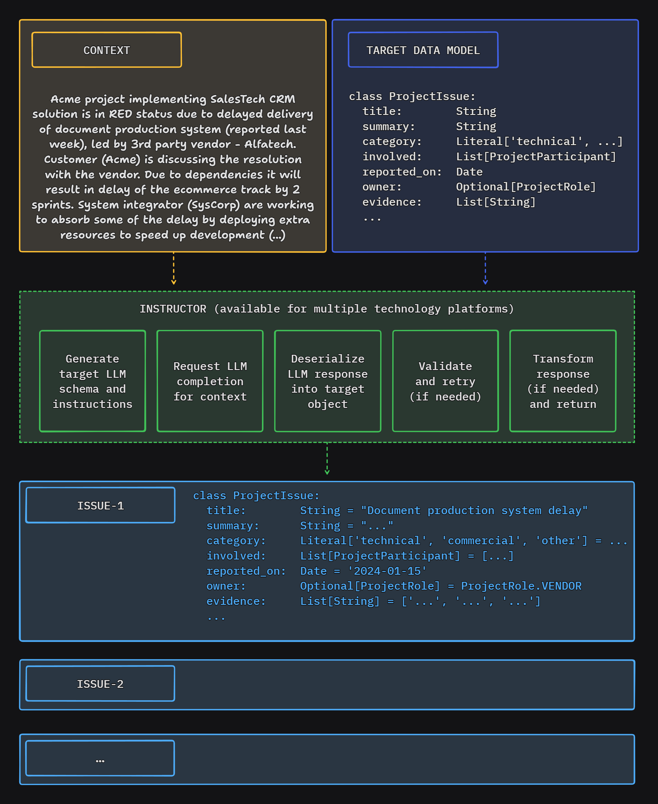

# Instructor for PHP

Structured data extraction in PHP, powered by LLMs. Designed for simplicity, transparency, and control.

## What is Instructor?

Instructor is a library that allows you to extract structured, validated data from unstructured text or OpenAI style chat sequence arrays. It is powered by Large Language Models.

Instructor for PHP is inspired by the [Instructor](https://jxnl.github.io/instructor/) library for Python created by [Jason Liu](https://twitter.com/jxnlco).

Here's recording of a simple CLI demo app using Instructor to extract structured data from text:

## Feature highlights

### General

 - Get structured responses from LLM inference
 - Automate validation & retries

### Flexible inputs

 - Process various types of input data: text, series of chat messages or images
 - 'Structured-to-structured' processing - provide object or array as an input and get object with the results of inference back
 - Customize prompts and retry prompts
 - Use attributes or PHP DocBlocks to provide additional instructions for LLM
 - Demonstrate examples to improve the quality of inference

### Customizable output models
 
 - Define response data model the way to need: type-hinted classes, JSON Schema arrays, or dynamically define your data shapes with Structures
 - Customize response model processing by providing your own implementation of schema, deserialization, validation and transformation interfaces

### Sync and streaming support
 - Receive synchronous or streaming responses
 - Get partial updates & stream completed sequence items

### Observability

 - Get detailed insight into internal processing via events

### Support for multiple LLMs / API providers
 - Use multiple LLM API providers (incl. OpenAI,  Anthropic, Cohere, Azure, Groq, Mistral, Anyscale, Fireworks AI, Ollama, OpenRouter, Together AI)
 - Use local models with Ollama

### Documentation and examples

 - Learn more from growing documentation and 50+ cookbooks

## Instructor in Other Languages

Check out implementations in other languages below:

 - [Python](https://www.github.com/jxnl/instructor) (original)
 - [Javascript](https://github.com/instructor-ai/instructor-js) (port)
 - [Elixir](https://github.com/thmsmlr/instructor_ex/) (port)

If you want to port Instructor to another language, please reach out to us on [Twitter](https://twitter.com/jxnlco) we'd love to help you get started!

## How Instructor Enhances Your Workflow

Instructor introduces three key enhancements compared to direct API usage.

### Response Model

You just specify a PHP class to extract data into via the 'magic' of LLM chat completion. And that's it.

Instructor reduces brittleness of the code extracting the information from textual data by leveraging structured LLM responses.

Instructor helps you write simpler, easier to understand code - you no longer have to define lengthy function call definitions or write code for assigning returned JSON into target data objects.

### Validation

Response model generated by LLM can be automatically validated, following set of rules. Currently, Instructor supports only Symfony validation.

You can also provide a context object to use enhanced validator capabilities.

### Max Retries

You can set the number of retry attempts for requests.

Instructor will repeat requests in case of validation or deserialization error up to the specified number of times, trying to get a valid response from LLM.

## Explore

 - [Philosophy of Instructor](./concepts/philosophy.md)
 - [Cookbook](./hub/index.md)
 - [Internals of Instructor](./internals/index.md)

Also, check examples in the `examples` directory of this repository for fully working, tested code examples that you can execute from the command line and see Instructor in action.

## Additional Notes

PHP ecosystem does not (yet) have a strong equivalent of [Pydantic](https://pydantic.dev/), which is at the core of Instructor for Python.

To provide an essential functionality we needed here Instructor for PHP leverages:

 - base capabilities of [PHP type system](https://www.php.net/manual/en/language.types.type-system.php),
 - [PHP reflection](https://www.php.net/manual/en/book.reflection.php),
 - [PHP DocBlock](https://docs.phpdoc.org/2.9/references/phpdoc/index.html) type hinting conventions,
 - [Symfony](https://symfony.com/doc/current/index.html) serialization and validation capabilities

Instructor for PHP works with OpenAI, Anthropic, local Ollama and many other providers. Check out the [LLM Providers](llm_providers.md) section for more information.

## Dependencies

Instructor for PHP is compatible with PHP 8.2 or later and, due to minimal dependencies, should work with any framework of your choice.

 - [SaloonPHP](https://docs.saloon.dev/) - for handling communication with LLM API providers
 - [Symfony components](https://symfony.com/) - for validation, serialization and other utilities

## License

This project is licensed under the terms of the MIT License.
