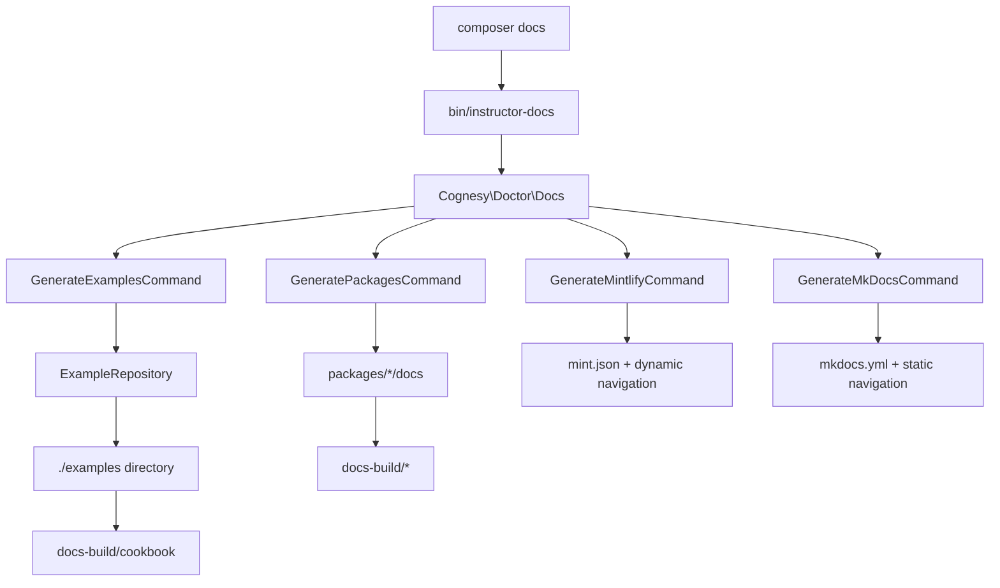

# Examples Reorganization Research

## Executive Summary

This document analyzes the current documentation build system and provides recommendations for reorganizing the examples directory structure from a centralized `./examples` directory to package-specific `packages/*/examples` directories.

**Key Findings:**
- Current examples are centrally managed but could be organized by package
- Documentation build system is flexible and can accommodate the reorganization
- Both Mintlify and MkDocs systems support dynamic navigation generation
- Package-specific examples would improve maintainability and separation of concerns

**Recommended Approach:**
- Hybrid approach: Package-specific examples with optional aggregation build artifact
- Gradual migration strategy to minimize disruption
- Enhanced ExampleRepository to scan multiple directories

## Current Architecture Analysis

### Documentation Build Process



### Current Example Structure

```
examples/
├── A01_Basics/          # Instructor basics
├── A02_Advanced/        # Instructor advanced
├── A03_Troubleshooting/ # Instructor troubleshooting
├── A04_APISupport/      # Instructor API support
├── A05_Extras/          # Instructor extras
├── B01_LLM/            # Polyglot basics
├── B02_LLMAdvanced/    # Polyglot advanced
├── B03_LLMTroubleshooting/ # Polyglot troubleshooting
├── B04_LLMApiSupport/  # Polyglot API support
├── B05_LLMExtras/      # Polyglot extras
├── C01_ZeroShot/       # Prompting techniques
├── C02_FewShot/        # Prompting techniques
├── C03_ThoughtGen/     # Prompting techniques
├── C04_Ensembling/     # Prompting techniques
├── C05_SelfCriticism/  # Prompting techniques
├── C06_Decomposition/  # Prompting techniques
└── C07_Misc/           # Prompting techniques
```

### Package Documentation Structure

```
packages/
├── instructor/docs/        # Instructor package docs
├── polyglot/docs/          # Polyglot package docs
├── http-client/docs/       # HTTP client package docs
└── [other-packages]/docs/  # Other package docs
```

## Analysis Findings

### 1. Example-to-Package Mapping

**Current Mapping in `Example.php`:**

```php
$mapping = [
    'A01_Basics' => ['tab' => 'instructor', 'name' => 'basics'],
    'A02_Advanced' => ['tab' => 'instructor', 'name' => 'advanced'],
    'A03_Troubleshooting' => ['tab' => 'instructor', 'name' => 'troubleshooting'],
    'A04_APISupport' => ['tab' => 'instructor', 'name' => 'api_support'],
    'A05_Extras' => ['tab' => 'instructor', 'name' => 'extras'],
    'B01_LLM' => ['tab' => 'polyglot', 'name' => 'llm_basics'],
    'B02_LLMAdvanced' => ['tab' => 'polyglot', 'name' => 'llm_advanced'],
    'B03_LLMTroubleshooting' => ['tab' => 'polyglot', 'name' => 'llm_troubleshooting'],
    'B04_LLMApiSupport' => ['tab' => 'polyglot', 'name' => 'llm_api_support'],
    'B05_LLMExtras' => ['tab' => 'polyglot', 'name' => 'llm_extras'],
    'C01_ZeroShot' => ['tab' => 'prompting', 'name' => 'zero_shot'],
    // ... more prompting examples
];
```

**Proposed Package Mapping:**
- `A01-A05` → `packages/instructor/examples/`
- `B01-B05` → `packages/polyglot/examples/`
- `C01-C07` → `packages/instructor/examples/` (since they use Instructor APIs)

### 2. Documentation Build System

**Strengths:**
- Modular design with separate commands for examples vs packages
- Support for both Mintlify and MkDocs
- Dynamic navigation generation for Mintlify
- Timestamp-based file change detection

**Flexibility Points:**
- `ExampleRepository` scans configurable directory
- `DocumentationConfig` can be extended
- Commands can be modified to handle multiple source directories

### 3. Navigation Generation

**Mintlify (Dynamic):**
- Navigation generated at build time
- Examples added to mint.json dynamically
- Easy to extend for multiple sources

**MkDocs (Static):**
- Navigation hardcoded in mkdocs.yml
- Would need to be updated or made dynamic

## Recommended Solutions

### Option 1: Hybrid Approach (Recommended)

**Structure:**
```
packages/
├── instructor/examples/     # Package-specific examples
├── polyglot/examples/       # Package-specific examples
└── [other]/examples/

./examples/                  # Build artifact (aggregated examples)
├── instructor/              # Symlinks or copies from packages/instructor/examples
├── polyglot/               # Symlinks or copies from packages/polyglot/examples
└── [other]/

docs-build/cookbook/         # Final documentation output
├── instructor/
├── polyglot/
└── [other]/
```

**Benefits:**
- Package-specific organization for maintainability
- Backward compatibility with existing build system
- Gradual migration path
- Clear ownership of examples

**Implementation:**
1. Create package-specific examples directories
2. Migrate examples gradually by category
3. Update ExampleRepository to support multiple source directories
4. Optional: Create build step to aggregate examples into ./examples
5. Update documentation as needed

### Option 2: Multi-Source Repository

**Structure:**
```
packages/
├── instructor/examples/     # Package-specific examples only
├── polyglot/examples/       # Package-specific examples only
└── [other]/examples/

# No centralized ./examples directory
```

**Benefits:**
- Cleanest separation of concerns
- No duplicate files
- Forces proper package organization

**Implementation:**
1. Enhance ExampleRepository to scan multiple package directories
2. Update Example.php mapping to use package-based paths
3. Migrate all examples to packages
4. Remove centralized ./examples directory
5. Update all documentation build processes

### Option 3: Build-Time Aggregation

**Structure:**
```
packages/
├── instructor/examples/     # Source examples
├── polyglot/examples/       # Source examples
└── [other]/examples/

./examples/                  # Generated build artifact
├── [aggregated content]

docs-build/cookbook/         # Final documentation output
```

**Benefits:**
- Clean package separation
- Build system generates unified structure
- Maintains existing API compatibility

**Implementation:**
1. Create new build command to aggregate examples
2. Modify composer scripts to run aggregation before docs
3. Update .gitignore to exclude generated ./examples
4. Gradual migration of source examples

## Technical Implementation Details

### 1. ExampleRepository Enhancement

**Current Implementation:**
```php
public function __construct(string $baseDir) {
    $this->baseDir = $baseDir ?: ($this->guessBaseDir() . '/');
}
```

**Proposed Enhancement:**
```php
public function __construct(array $baseDirs = []) {
    $this->baseDirs = empty($baseDirs) ? [$this->guessBaseDir()] : $baseDirs;
}

private function getExampleDirectories(): array {
    $directories = [];
    foreach ($this->baseDirs as $baseDir) {
        $directories = array_merge($directories, $this->scanDirectory($baseDir));
    }
    return $directories;
}
```

### 2. Package Detection Strategy

**Directory-Based Detection:**
```php
private function detectPackageFromPath(string $path): string {
    if (str_contains($path, 'packages/instructor/')) return 'instructor';
    if (str_contains($path, 'packages/polyglot/')) return 'polyglot';
    // ... more packages
    return 'general';
}
```

**Namespace-Based Detection:**
```php
private function detectPackageFromCode(string $content): string {
    if (str_contains($content, 'Cognesy\\Instructor\\')) return 'instructor';
    if (str_contains($content, 'Cognesy\\Polyglot\\')) return 'polyglot';
    // ... more packages
    return 'general';
}
```

### 3. Build Process Integration

**Option A: Composer Script Integration**
```json
{
    "scripts": {
        "docs": [
            "@php bin/aggregate-examples",
            "@php bin/instructor-docs"
        ]
    }
}
```

**Option B: Integrated Build Command**
```php
class GenerateDocsCommand extends Command {
    protected function execute(InputInterface $input, OutputInterface $output): int {
        $this->aggregateExamples();
        $this->generateDocumentation();
        return Command::SUCCESS;
    }
}
```

### 4. Migration Strategy

**Phase 1: Infrastructure**
- [ ] Create package examples directories
- [ ] Enhance ExampleRepository for multi-source support
- [ ] Create aggregation build process
- [ ] Update composer scripts

**Phase 2: Content Migration**
- [ ] Migrate Instructor examples (A01-A05)
- [ ] Migrate Polyglot examples (B01-B05)
- [ ] Migrate Prompting examples (C01-C07)
- [ ] Update example cross-references

**Phase 3: Cleanup**
- [ ] Remove centralized examples (if using Option 2)
- [ ] Update documentation references
- [ ] Clean up obsolete configuration

### 5. Backward Compatibility

**During Migration:**
- Keep existing ./examples structure during transition
- Support both old and new paths in ExampleRepository
- Maintain existing documentation URLs

**Post-Migration:**
- Optionally redirect old paths to new structure
- Update all internal documentation references
- Clean up deprecated configuration

## Risk Assessment

### Low Risk
- **Package examples creation**: No impact on existing system
- **ExampleRepository enhancement**: Backward compatible changes
- **Documentation updates**: Non-breaking additions

### Medium Risk
- **Navigation changes**: May require MkDocs navigation updates
- **Build process changes**: Could affect CI/CD if not done carefully
- **Example migration**: Risk of broken links during transition

### High Risk
- **Complete ./examples removal**: Would break any hardcoded references
- **Major refactoring**: Risk of documentation generation failures

## Recommendations

### Immediate Actions (Phase 1)

1. **Create package examples directories:**
   ```bash
   mkdir -p packages/instructor/examples
   mkdir -p packages/polyglot/examples
   ```

2. **Enhance ExampleRepository** to support multiple directories while maintaining backward compatibility

3. **Create build aggregation process** to populate ./examples from package sources

4. **Update composer scripts** to run aggregation before documentation build

### Medium-term Actions (Phase 2)

1. **Migrate examples by category:**
   - Start with A01_Basics → packages/instructor/examples/basics/
   - Continue with other categories systematically
   - Test documentation build after each migration

2. **Update cross-references** and documentation as examples move

3. **Validate both Mintlify and MkDocs** output throughout migration

### Long-term Actions (Phase 3)

1. **Consider making ./examples a pure build artifact** (Option 3)
2. **Update MkDocs navigation** to be more dynamic if desired
3. **Document the new structure** for future contributors

## Conclusion

The recommended **Hybrid Approach (Option 1)** provides the best balance of:
- **Maintainability**: Package-specific organization
- **Compatibility**: Existing build system continues working
- **Flexibility**: Gradual migration with fallback options
- **Future-proofing**: Foundation for further modularization

This approach allows for a controlled migration with minimal risk to the existing documentation system while achieving the goal of package-specific example organization.