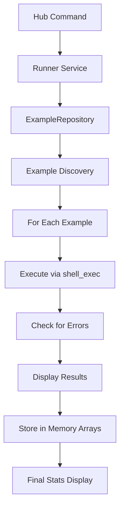
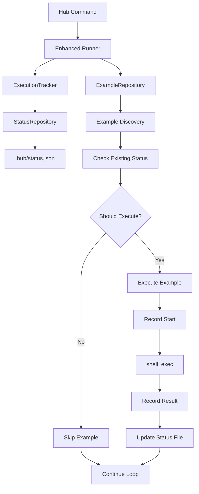

# Hub Execution Tracking Design Study

## Executive Summary

This document presents a comprehensive design for enhancing the Hub example execution system with persistent status tracking, error management, and performance monitoring capabilities.

**Goals:**
- Track example execution status persistently in `.hub/status.json`
- Enable selective re-execution of failed examples
- Provide performance bottleneck identification
- Support interrupted execution recovery
- Add new hub commands for advanced workflows

**Scope:**
- Design follows DDD principles with `Can<DoSomething>` interface naming
- Integrates seamlessly with existing console command system
- Maintains backward compatibility
- Excludes status file from git tracking

## Current Architecture Analysis

### Current Command Structure
- `list` - Lists all examples (default)
- `run <example>` - Runs one specific example
- `all [index]` - Runs all examples from optional starting index
- `show <example>` - Shows example details

### Current Execution Flow


### Current Data Structures
- **Example**: Contains index, group, name, title, paths, etc.
- **ErrorEvent**: Simple file + output container
- **Runner**: In-memory counters and error arrays

### Limitations Identified
- No persistent storage of execution results
- No way to resume interrupted runs
- No historical performance data
- No selective re-execution capabilities
- Errors lost when process interrupted
- No detailed timing information per example

## Proposed Architecture

### Enhanced Execution Flow


### Status File Structure

**File Location:** `.hub/status.json` (git-ignored)

**JSON Schema:**
```json
{
  "metadata": {
    "version": "1.0",
    "lastUpdated": "2024-12-07T15:30:45Z",
    "totalExamples": 213
  },
  "examples": {
    "1": {
      "index": 1,
      "name": "Basic",
      "group": "instructor/basics",
      "relativePath": "./examples/A01_Basics/Basic/run.php",
      "absolutePath": "/path/to/examples/A01_Basics/Basic/run.php",
      "lastExecuted": "2024-12-07T15:25:30Z",
      "status": "completed",
      "executionTime": 1.245,
      "attempts": 3,
      "errors": [],
      "output": "Execution successful...",
      "exitCode": 0
    },
    "2": {
      "index": 2,
      "name": "BasicConstructor",
      "group": "instructor/basics",
      "relativePath": "./examples/A01_Basics/BasicConstructor/run.php",
      "absolutePath": "/path/to/examples/A01_Basics/BasicConstructor/run.php",
      "lastExecuted": "2024-12-07T15:26:15Z",
      "status": "error",
      "executionTime": 0.856,
      "attempts": 1,
      "errors": [
        {
          "timestamp": "2024-12-07T15:26:15Z",
          "type": "fatal_error",
          "message": "Fatal error: Undefined function...",
          "output": "Full error output here...",
          "exitCode": 1
        }
      ],
      "output": "Error output...",
      "exitCode": 1
    }
  },
  "statistics": {
    "totalExecuted": 150,
    "completed": 148,
    "errors": 2,
    "skipped": 63,
    "averageExecutionTime": 1.234,
    "totalExecutionTime": 185.032,
    "lastFullRun": "2024-12-07T14:00:00Z",
    "lastPartialRun": "2024-12-07T15:30:45Z"
  }
}
```

### Status Types
```php
enum ExecutionStatus: string
{
    case PENDING = 'pending';         // Never executed
    case RUNNING = 'running';         // Currently executing
    case COMPLETED = 'completed';     // Successful execution
    case ERROR = 'error';             // Failed execution
    case INTERRUPTED = 'interrupted'; // Execution was interrupted
    case SKIPPED = 'skipped';         // Intentionally skipped
    case STALE = 'stale';             // File modified since last execution
}
```

## Domain Design (DDD)

### Value Objects
```php
// packages/hub/src/Data/ExecutionResult.php
class ExecutionResult
{
    public function __construct(
        public readonly ExecutionStatus $status,
        public readonly float $executionTime,
        public readonly int $exitCode,
        public readonly string $output,
        public readonly ?ExecutionError $error,
        public readonly \DateTimeImmutable $timestamp,
    ) {}
}

// packages/hub/src/Data/ExecutionError.php
class ExecutionError
{
    public function __construct(
        public readonly string $type,
        public readonly string $message,
        public readonly string $fullOutput,
        public readonly int $exitCode,
        public readonly \DateTimeImmutable $timestamp,
    ) {}
}

// packages/hub/src/Data/ExecutionSummary.php
class ExecutionSummary
{
    public function __construct(
        public readonly int $totalExamples,
        public readonly int $executed,
        public readonly int $completed,
        public readonly int $errors,
        public readonly int $skipped,
        public readonly float $averageTime,
        public readonly float $totalTime,
    ) {}
}
```

### Entities
```php
// packages/hub/src/Data/ExampleExecutionStatus.php
class ExampleExecutionStatus
{
    public function __construct(
        private int $index,
        private string $name,
        private string $group,
        private string $relativePath,
        private string $absolutePath,
        private ExecutionStatus $status,
        private ?\DateTimeImmutable $lastExecuted,
        private float $executionTime,
        private int $attempts,
        private array $errors,
        private string $output,
        private int $exitCode,
    ) {}

    public function isStale(string $filePath): bool {
        if (!$this->lastExecuted || !file_exists($filePath)) {
            return true;
        }

        $fileModified = new \DateTimeImmutable('@' . filemtime($filePath));
        return $fileModified > $this->lastExecuted;
    }

    public function hasRecentError(\DateInterval $interval = null): bool {
        $interval ??= new \DateInterval('P1D'); // Default: 1 day
        $cutoff = (new \DateTimeImmutable())->sub($interval);

        return $this->status === ExecutionStatus::ERROR
            && $this->lastExecuted
            && $this->lastExecuted > $cutoff;
    }

    public function shouldExecute(ExecutionFilter $filter): bool {
        return match($filter->mode) {
            FilterMode::ALL => true,
            FilterMode::ERRORS_ONLY => $this->status === ExecutionStatus::ERROR,
            FilterMode::STALE_ONLY => $this->isStale($this->absolutePath),
            FilterMode::PENDING_ONLY => $this->status === ExecutionStatus::PENDING,
            FilterMode::NOT_COMPLETED => $this->status !== ExecutionStatus::COMPLETED,
        };
    }
}
```

### Interfaces (Contracts)
```php
// packages/hub/src/Contracts/CanTrackExecution.php
interface CanTrackExecution
{
    public function recordStart(Example $example): void;
    public function recordResult(Example $example, ExecutionResult $result): void;
    public function getStatus(Example $example): ?ExampleExecutionStatus;
    public function getSummary(): ExecutionSummary;
}

// packages/hub/src/Contracts/CanPersistStatus.php
interface CanPersistStatus
{
    public function save(array $statusData): void;
    public function load(): array;
    public function exists(): bool;
    public function clear(): void;
}

// packages/hub/src/Contracts/CanFilterExamples.php
interface CanFilterExamples
{
    public function shouldExecute(ExampleExecutionStatus $status): bool;
    public function getDescription(): string;
}

// packages/hub/src/Contracts/CanExecuteExample.php
interface CanExecuteExample
{
    public function execute(Example $example): ExecutionResult;
    public function setTracker(CanTrackExecution $tracker): void;
}

// packages/hub/src/Contracts/CanFormatExecutionOutput.php
interface CanFormatExecutionOutput
{
    public function formatResult(Example $example, ExecutionResult $result): string;
    public function formatSummary(ExecutionSummary $summary): string;
    public function formatProgress(int $current, int $total): string;
}
```

### Services
```php
// packages/hub/src/Services/ExecutionTracker.php
class ExecutionTracker implements CanTrackExecution
{
    private array $statusData = [];

    public function __construct(
        private CanPersistStatus $repository,
        private \DateTimeZone $timezone = new \DateTimeZone('UTC'),
    ) {
        $this->statusData = $this->repository->load();
    }

    public function recordStart(Example $example): void {
        $this->statusData['examples'][$example->index] = [
            'status' => ExecutionStatus::RUNNING->value,
            'startTime' => (new \DateTimeImmutable('now', $this->timezone))->format('c'),
            // ... other fields
        ];

        $this->repository->save($this->statusData);
    }

    public function recordResult(Example $example, ExecutionResult $result): void {
        $this->statusData['examples'][$example->index] = [
            'index' => $example->index,
            'name' => $example->name,
            'group' => $example->group,
            'relativePath' => $example->relativePath,
            'absolutePath' => $example->runPath,
            'lastExecuted' => $result->timestamp->format('c'),
            'status' => $result->status->value,
            'executionTime' => $result->executionTime,
            'attempts' => ($this->statusData['examples'][$example->index]['attempts'] ?? 0) + 1,
            'errors' => $result->error ? [$this->formatError($result->error)] : [],
            'output' => $result->output,
            'exitCode' => $result->exitCode,
        ];

        $this->updateMetadata();
        $this->repository->save($this->statusData);
    }

    private function updateMetadata(): void {
        $this->statusData['metadata'] = [
            'version' => '1.0',
            'lastUpdated' => (new \DateTimeImmutable('now', $this->timezone))->format('c'),
            'totalExamples' => count($this->statusData['examples']),
        ];

        $this->statusData['statistics'] = $this->calculateStatistics();
    }

    private function calculateStatistics(): array {
        $examples = $this->statusData['examples'];
        $completed = array_filter($examples, fn($e) => $e['status'] === 'completed');
        $errors = array_filter($examples, fn($e) => $e['status'] === 'error');

        $totalTime = array_sum(array_column($examples, 'executionTime'));
        $avgTime = count($examples) > 0 ? $totalTime / count($examples) : 0;

        return [
            'totalExecuted' => count($examples),
            'completed' => count($completed),
            'errors' => count($errors),
            'skipped' => 0, // Calculate based on total vs executed
            'averageExecutionTime' => $avgTime,
            'totalExecutionTime' => $totalTime,
            'lastFullRun' => $this->getLastFullRun(),
            'lastPartialRun' => (new \DateTimeImmutable('now', $this->timezone))->format('c'),
        ];
    }
}

// packages/hub/src/Services/StatusRepository.php
class StatusRepository implements CanPersistStatus
{
    public function __construct(
        private string $statusFilePath = '.hub/status.json',
        private Filesystem $filesystem = new Filesystem(),
    ) {
        $this->ensureDirectoryExists();
    }

    public function save(array $statusData): void {
        $json = json_encode($statusData, JSON_PRETTY_PRINT | JSON_UNESCAPED_SLASHES);
        $this->filesystem->dumpFile($this->statusFilePath, $json);
    }

    public function load(): array {
        if (!$this->exists()) {
            return $this->getEmptyStructure();
        }

        $content = file_get_contents($this->statusFilePath);
        $data = json_decode($content, true);

        if (json_last_error() !== JSON_ERROR_NONE) {
            throw new InvalidStatusFileException('Invalid JSON in status file: ' . json_last_error_msg());
        }

        return $data;
    }

    public function exists(): bool {
        return file_exists($this->statusFilePath);
    }

    public function clear(): void {
        if ($this->exists()) {
            unlink($this->statusFilePath);
        }
    }

    private function ensureDirectoryExists(): void {
        $dir = dirname($this->statusFilePath);
        if (!is_dir($dir)) {
            mkdir($dir, 0755, true);
        }
    }

    private function getEmptyStructure(): array {
        return [
            'metadata' => [
                'version' => '1.0',
                'lastUpdated' => (new \DateTimeImmutable())->format('c'),
                'totalExamples' => 0,
            ],
            'examples' => [],
            'statistics' => [
                'totalExecuted' => 0,
                'completed' => 0,
                'errors' => 0,
                'skipped' => 0,
                'averageExecutionTime' => 0,
                'totalExecutionTime' => 0,
                'lastFullRun' => null,
                'lastPartialRun' => null,
            ],
        ];
    }
}

// packages/hub/src/Services/EnhancedRunner.php
class EnhancedRunner implements CanExecuteExample
{
    private ?CanTrackExecution $tracker = null;

    public function __construct(
        private ExampleRepository $examples,
        private CanFormatExecutionOutput $formatter,
        private bool $displayErrors = true,
        private int $stopAfter = 0,
        private bool $stopOnError = false,
    ) {}

    public function setTracker(CanTrackExecution $tracker): void {
        $this->tracker = $tracker;
    }

    public function execute(Example $example): ExecutionResult {
        $startTime = microtime(true);

        $this->tracker?->recordStart($example);

        try {
            $output = $this->executeShell($example->runPath);
            $endTime = microtime(true);
            $executionTime = $endTime - $startTime;

            $hasErrors = $this->hasErrors($output);
            $status = $hasErrors ? ExecutionStatus::ERROR : ExecutionStatus::COMPLETED;
            $exitCode = $hasErrors ? 1 : 0;

            $error = $hasErrors ? new ExecutionError(
                type: 'fatal_error',
                message: $this->extractErrorMessage($output),
                fullOutput: $output,
                exitCode: $exitCode,
                timestamp: new \DateTimeImmutable(),
            ) : null;

            $result = new ExecutionResult(
                status: $status,
                executionTime: $executionTime,
                exitCode: $exitCode,
                output: $output,
                error: $error,
                timestamp: new \DateTimeImmutable(),
            );

            $this->tracker?->recordResult($example, $result);

            return $result;

        } catch (\Throwable $e) {
            $endTime = microtime(true);
            $executionTime = $endTime - $startTime;

            $error = new ExecutionError(
                type: 'exception',
                message: $e->getMessage(),
                fullOutput: $e->getTraceAsString(),
                exitCode: 1,
                timestamp: new \DateTimeImmutable(),
            );

            $result = new ExecutionResult(
                status: ExecutionStatus::ERROR,
                executionTime: $executionTime,
                exitCode: 1,
                output: '',
                error: $error,
                timestamp: new \DateTimeImmutable(),
            );

            $this->tracker?->recordResult($example, $result);

            return $result;
        }
    }

    private function executeShell(string $runPath): string {
        $command = 'php ' . escapeshellarg($runPath) . ' 2>&1';
        $output = shell_exec($command);
        return $output ?: '';
    }

    private function hasErrors(string $output): bool {
        return str_contains($output, 'Fatal error')
            || str_contains($output, 'Parse error')
            || str_contains($output, 'Error:');
    }

    private function extractErrorMessage(string $output): string {
        $lines = explode("\n", $output);
        foreach ($lines as $line) {
            if (str_contains($line, 'Fatal error') || str_contains($line, 'Error:')) {
                return trim($line);
            }
        }
        return 'Unknown error';
    }
}
```

### Filter System
```php
// packages/hub/src/Data/ExecutionFilter.php
enum FilterMode: string
{
    case ALL = 'all';
    case ERRORS_ONLY = 'errors';
    case STALE_ONLY = 'stale';
    case PENDING_ONLY = 'pending';
    case NOT_COMPLETED = 'not-completed';
}

class ExecutionFilter implements CanFilterExamples
{
    public function __construct(
        public readonly FilterMode $mode,
        public readonly ?\DateInterval $staleThreshold = null,
        public readonly ?\DateInterval $errorThreshold = null,
    ) {}

    public function shouldExecute(ExampleExecutionStatus $status): bool {
        return match($this->mode) {
            FilterMode::ALL => true,
            FilterMode::ERRORS_ONLY => $status->hasRecentError($this->errorThreshold),
            FilterMode::STALE_ONLY => $status->isStale($status->absolutePath),
            FilterMode::PENDING_ONLY => $status->status === ExecutionStatus::PENDING,
            FilterMode::NOT_COMPLETED => $status->status !== ExecutionStatus::COMPLETED,
        };
    }

    public function getDescription(): string {
        return match($this->mode) {
            FilterMode::ALL => 'all examples',
            FilterMode::ERRORS_ONLY => 'examples with errors',
            FilterMode::STALE_ONLY => 'examples with outdated results',
            FilterMode::PENDING_ONLY => 'examples never executed',
            FilterMode::NOT_COMPLETED => 'examples not completed successfully',
        };
    }
}
```

## New Hub Commands

### Enhanced Existing Commands
```php
// packages/hub/src/Commands/EnhancedRunAllExamples.php
class EnhancedRunAllExamples extends Command
{
    protected function configure(): void {
        $this
            ->setName('all')
            ->setDescription('Run all examples with tracking')
            ->addArgument('index', InputArgument::OPTIONAL, 'Starting index (optional)')
            ->addOption('filter', 'f', InputOption::VALUE_REQUIRED, 'Filter mode: all|errors|stale|pending|not-completed', 'all')
            ->addOption('force', null, InputOption::VALUE_NONE, 'Force execution even if recently run')
            ->addOption('parallel', 'p', InputOption::VALUE_OPTIONAL, 'Number of parallel processes', 1)
            ->addOption('dry-run', null, InputOption::VALUE_NONE, 'Show what would be executed without running');
    }

    protected function execute(InputInterface $input, OutputInterface $output): int {
        $filter = $this->createFilter($input->getOption('filter'));
        $force = $input->getOption('force');
        $dryRun = $input->getOption('dry-run');
        $startIndex = $input->getArgument('index') ? (int) $input->getArgument('index') : 0;

        $examples = $this->filterExamples($filter, $force, $startIndex);

        if ($dryRun) {
            $this->showDryRun($examples, $output);
            return Command::SUCCESS;
        }

        $this->executeExamples($examples, $output);

        return Command::SUCCESS;
    }
}

// packages/hub/src/Commands/RunErrorsCommand.php
class RunErrorsCommand extends Command
{
    protected function configure(): void {
        $this
            ->setName('errors')
            ->setDescription('Re-run examples that failed in previous executions')
            ->addOption('since', 's', InputOption::VALUE_REQUIRED, 'Only errors since date (e.g. "yesterday", "1 hour ago")')
            ->addOption('limit', 'l', InputOption::VALUE_REQUIRED, 'Limit number of examples to run', 0);
    }
}

// packages/hub/src/Commands/RunStaleCommand.php
class RunStaleCommand extends Command
{
    protected function configure(): void {
        $this
            ->setName('stale')
            ->setDescription('Run examples whose source files have been modified since last execution')
            ->addOption('threshold', 't', InputOption::VALUE_REQUIRED, 'How old results can be (e.g. "1 hour", "1 day")', '1 day');
    }
}

// packages/hub/src/Commands/StatusCommand.php
class StatusCommand extends Command
{
    protected function configure(): void {
        $this
            ->setName('status')
            ->setDescription('Show execution status summary')
            ->addOption('detailed', 'd', InputOption::VALUE_NONE, 'Show detailed status for each example')
            ->addOption('errors-only', 'e', InputOption::VALUE_NONE, 'Show only examples with errors')
            ->addOption('format', 'f', InputOption::VALUE_REQUIRED, 'Output format: table|json|csv', 'table');
    }
}

// packages/hub/src/Commands/CleanStatusCommand.php
class CleanStatusCommand extends Command
{
    protected function configure(): void {
        $this
            ->setName('clean')
            ->setDescription('Clean execution status data')
            ->addOption('all', 'a', InputOption::VALUE_NONE, 'Remove all status data')
            ->addOption('completed', 'c', InputOption::VALUE_NONE, 'Remove status for completed examples only')
            ->addOption('older-than', 'o', InputOption::VALUE_REQUIRED, 'Remove status older than specified time');
    }
}

// packages/hub/src/Commands/StatsCommand.php
class StatsCommand extends Command
{
    protected function configure(): void {
        $this
            ->setName('stats')
            ->setDescription('Show execution statistics and performance metrics')
            ->addOption('since', 's', InputOption::VALUE_REQUIRED, 'Statistics since date (e.g. "yesterday")')
            ->addOption('format', 'f', InputOption::VALUE_REQUIRED, 'Output format: table|json|chart', 'table')
            ->addOption('slowest', null, InputOption::VALUE_REQUIRED, 'Show N slowest examples', 10);
    }
}

// packages/hub/src/Commands/WatchCommand.php
class WatchCommand extends Command
{
    protected function configure(): void {
        $this
            ->setName('watch')
            ->setDescription('Watch for file changes and auto-run affected examples')
            ->addArgument('paths', InputArgument::IS_ARRAY, 'Paths to watch (default: examples directory)')
            ->addOption('debounce', 'd', InputOption::VALUE_REQUIRED, 'Debounce delay in seconds', 2);
    }
}
```

### Command Usage Examples
```bash
# Current commands (enhanced)
composer hub all                    # Run all examples with tracking
composer hub run 1                  # Run specific example with tracking
composer hub list                   # List examples with status info

# New filtering commands
composer hub errors                 # Re-run only failed examples
composer hub stale                  # Run examples with modified source files
composer hub all --filter=errors   # Same as 'errors' command
composer hub all --filter=stale    # Same as 'stale' command
composer hub all --filter=pending  # Run only never-executed examples

# Status and monitoring
composer hub status                 # Show execution summary
composer hub status --detailed     # Show per-example status
composer hub status --errors-only  # Show only examples with errors
composer hub stats                  # Show performance statistics
composer hub stats --slowest=20    # Show 20 slowest examples

# Advanced options
composer hub all --dry-run         # Preview what would be executed
composer hub all --force           # Ignore recent execution timestamps
composer hub all 50 --filter=stale # Start from example 50, only stale ones

# Maintenance
composer hub clean --completed     # Remove status for completed examples
composer hub clean --older-than="1 week"  # Clean old status data
composer hub clean --all           # Reset all status data

# Development workflow
composer hub watch examples/        # Auto-run examples when files change
```

## Integration Points

### Git Integration
**Add to `.gitignore`:**
```
.hub/
```

**Optional: Add git hooks for status cleanup:**
```bash
# .git/hooks/pre-commit
#!/bin/sh
# Clean stale status data before commits
composer hub clean --older-than="1 month" --silent
```

### CI/CD Integration
```yaml
# GitHub Actions example
- name: Run Examples
  run: |
    composer hub all --format=json > execution-results.json
    composer hub status --format=json > execution-status.json

- name: Archive Results
  uses: actions/upload-artifact@v3
  with:
    name: execution-results
    path: |
      execution-results.json
      execution-status.json
      .hub/status.json
```

### IDE Integration
**VS Code Tasks (`.vscode/tasks.json`):**
```json
{
    "version": "2.0.0",
    "tasks": [
        {
            "label": "Hub: Run Errors",
            "type": "shell",
            "command": "composer",
            "args": ["hub", "errors"],
            "group": "test",
            "presentation": {
                "echo": true,
                "reveal": "always",
                "focus": false,
                "panel": "shared"
            }
        }
    ]
}
```

## Implementation Priority

### Phase 1: Core Infrastructure (Week 1)
- [ ] Create value objects (`ExecutionResult`, `ExecutionError`, etc.)
- [ ] Implement core interfaces (`CanTrackExecution`, `CanPersistStatus`)
- [ ] Build `StatusRepository` and `ExecutionTracker`
- [ ] Create status file structure and JSON schema

### Phase 2: Enhanced Runner (Week 2)
- [ ] Implement `EnhancedRunner` with tracking capabilities
- [ ] Add filter system (`ExecutionFilter`, `FilterMode`)
- [ ] Integrate with existing `Runner` service
- [ ] Test backward compatibility

### Phase 3: New Commands (Week 2)
- [ ] Implement `status`, `errors`, `stale` commands
- [ ] Enhance existing `all` and `run` commands
- [ ] Add command-line options and validation
- [ ] Create output formatters

### Phase 4: Advanced Features (Week 3)
- [ ] Implement `stats`, `clean`, `watch` commands
- [ ] Add parallel execution support
- [ ] Create performance monitoring
- [ ] Add export/import capabilities

### Phase 5: Polish & Documentation (Week 3)
- [ ] Add comprehensive tests
- [ ] Create user documentation
- [ ] Add error handling and validation
- [ ] Performance optimizations

## Risk Assessment

### Low Risk
- Status file creation and basic tracking
- New command addition
- Enhanced output formatting

### Medium Risk
- Integration with existing Runner service
- Backward compatibility maintenance
- File system operations and permissions

### High Risk
- Parallel execution implementation
- File watching functionality
- Performance impact on large example sets

## Success Metrics

### Functional Requirements
- ✅ Persistent execution status tracking
- ✅ Selective re-execution of failed examples
- ✅ Performance bottleneck identification
- ✅ Interrupted execution recovery
- ✅ Git-ignored status storage

### Non-Functional Requirements
- ⚡ < 100ms overhead per example execution
- 📊 Support for 1000+ examples
- 🔧 Backward compatibility with existing commands
- 🎯 Zero breaking changes to existing API

### User Experience Goals
- 🚀 Faster development workflow with selective execution
- 🔍 Clear visibility into example health
- 📈 Historical performance tracking
- 🛠️ Reliable interrupted execution recovery

## Conclusion

This design provides a comprehensive solution for Hub execution tracking that:

1. **Maintains Compatibility**: Existing commands continue to work unchanged
2. **Follows DDD Principles**: Clean interfaces and domain modeling
3. **Enables New Workflows**: Selective execution, monitoring, and recovery
4. **Scales Effectively**: Supports hundreds of examples with minimal overhead
5. **Integrates Seamlessly**: Works with CI/CD, IDEs, and development workflows

The phased implementation approach ensures incremental delivery of value while minimizing risk to the existing system.